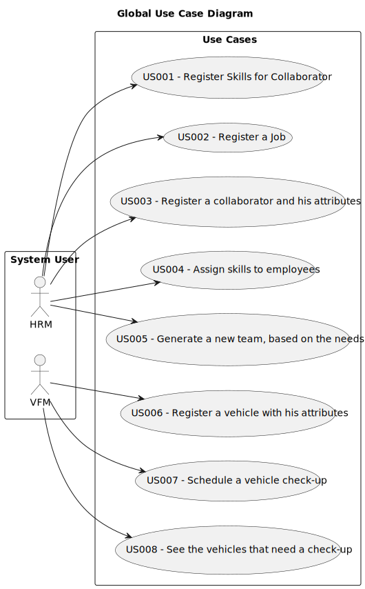

# Use Case Diagram (UCD)

**In the scope of this project, there is a direct relationship of _1 to 1_ between Use Cases (UC) and User Stories (US).**

However, be aware, this is a pedagogical simplification. On further projects and course units there may also exist _1 to N **and/or** N to 1_ relationships between UC and US.

**Insert below the Use Case Diagram in a SVG format**

**For each UC/US, it must be provided evidences of applying main activities of the software development process (requirements, analysis, design, tests and code). Gather those evidences on a separate file for each UC/US and set up a link as suggested below.**

# Use Cases / User Stories

| UC/US | Description                                                                              |                   
|:------|:-----------------------------------------------------------------------------------------|
| US001 | [Register a Skill](../../us001/Readme.md)                                                |
| US002 | [Register a Job](../../us002/Readme.md)                                                  |
| US003 | [Register a Collaborator](../../us006/Readme.md)                                         |
| ...   | As an HRM, I want to register a collaborator with a job and fundamental characteristics; |
| US004 | [Assing Skils](../../us006/Readme.md)                                                    |
| ...   | As an HRM, I want to assing one or more skills to a collaborator.                        |
| US005 | [Generate a team automatically](../../us006/Readme.md)                                   |
| ...   | As an HRM, I want to generate a team proposal automatically.                             |
| US006 | [Register a vehicle](../../us006/Readme.md)                                              |
| ...   | As an FM, I wish to register a vehicle including all the atrubutes.                      |
| US007 | [Register a vehicle´s checl-up](../../us006/Readme.md)                                   |
| ...   | As an FM, I wish to register a vehicle's check-up.                                       |
| US008 | [Listing vehicles needing chek-up](../../us006/Readme.md)                                |
| ...   | As an FM, I want to list the vehicles needing the check-up                               |
|       |                                                                                          |
