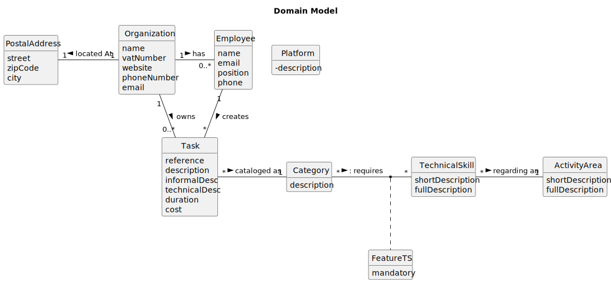

# OO Analysis

The construction process of the domain model is based on the client specifications, especially the nouns (for _concepts_) and verbs (for _relations_) used.

## Rationale to identify domain conceptual classes
To identify domain conceptual classes, start by making a list of candidate conceptual classes inspired by the list of categories suggested in the book "Applying UML and Patterns: An Introduction to Object-Oriented Analysis and Design and Iterative Development".

### _Conceptual Class Category List_

**Business Transactions**

* Employees
* Vehicles/Equipments

---

**Transaction Line Items**

* Checkup
* Tasks/Workforce
* Maintenance Activities

---

**Product/Service related to a Transaction or Transaction Line Item**

* Plant Materials
* Furniture
* Equipment
* Machines/Vehicles

---

**Transaction Records**

* Agenda
* Work Logs
* Checkup Register/Mileage Update

---  

**Roles of People or Organizations**

* HRM - Human Resources Manager
* VFM - Fleet Manager
* CLB - Collaborator

---

**Places**

* Green Spaces
* Garages

---

**Noteworthy Events**

* Checkup
* Team formation

---

**Physical Objects**

* Vehicles
* Machines
* Equipment

---

**Descriptions of Things**

* Job Descriptions
* Skill sets

---

**Catalogs**

* Skills Catalog
* Vehicle brand and model Catalog

---

**Containers**

* Teams

---

**Elements of Containers**

* Team Members

---

**Organizations**

* MS - MusgoSublime

---

**Other External/Collaborating Systems**

* User Portal

---

**Records of finance, work, contracts, legal matters**

* Admission date

---

**Financial Instruments**

* None -------------

---

**Documents mentioned/used to perform some work/**

* Reports
* Comments

---

## Rationale to identify associations between conceptual classes

An association is a relationship between instances of objects that indicates a relevant connection and that is worth of remembering, or it is derivable from the List of Common Associations:

- **_A_** is physically or logically part of **_B_**
- **_A_** is physically or logically contained in/on **_B_**
- **_A_** is a description for **_B_**
- **_A_** known/logged/recorded/reported/captured in **_B_**
- **_A_** uses or manages or owns **_B_**
- **_A_** is related with a transaction (item) of **_B_**
- etc.

| Concept (A) 		 |  Association   	  | Concept (B) |
|----------------|:-----------------:|------------:|
| Task  	        | assign to    		 	 |        Team |
| Vehicles  	    |      used by      |        Task |
| Collaborator   |        has        |       Skill |
| Vehicle        |       needs       |     Checkup |
| Collaborator   |    assigned to    |        Team |

## Domain Model

**Do NOT forget to identify concept attributes too.**

**Insert below the Domain Model Diagram in an SVG format**

