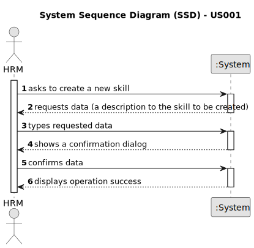
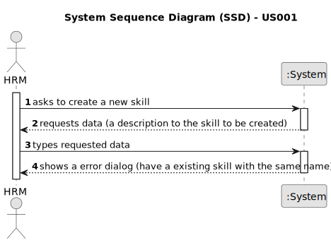

# US001 - Register a Skill 

## 1. Requirements Engineering

### 1.1. User Story Description

As a Human Resources Manager (HRM), I want to register skills that may
be appointed to a collaborator.

### 1.2. Customer Specifications and Clarifications 

**From the specifications document:**

>	A skill created should be saved in a skills list so that it can be assigned to one or more workers in the future. 

**From the client clarifications:**

> **Question:** Will a list of competences be provided?
>
> **Answer:** No. The human resources manager defines it and the system saves it for later association with a profile.

### 1.3. Acceptance Criteria

* **AC1:** All skill field must be filled in.
* **AC2:** If you create a skill with the same name as an existing skill, the system should show an information window and reject the skill.

### 1.4. Found out Dependencies

* None for now.  

### 1.5 Input and Output Data

**Input Data:**

* Typed data:
    * a designation 

	
* Selected data:
    * none

**Output Data:**

* (In)Success of the operation

### 1.6. System Sequence Diagram (SSD)

**_Other alternatives might exist._**

#### Alternative One

#### Alternative Two

### 1.7 Other Relevant Remarks

* The success of the operation is shown by the fact that no error is displayed on the screen and the competence is recorded in the list.