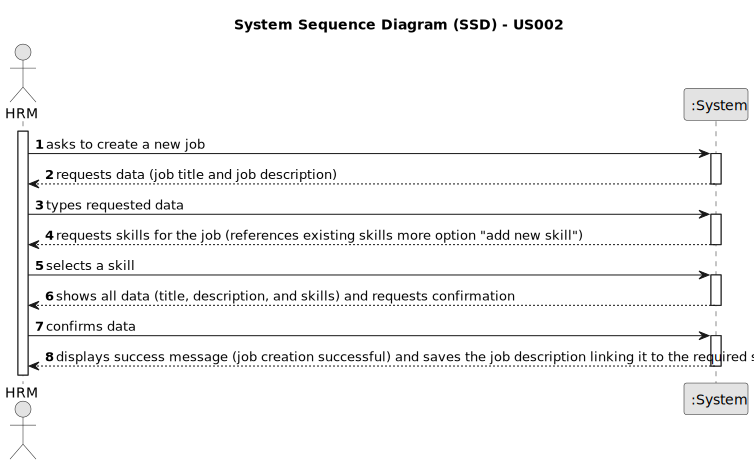

# US002 - Register a Job 

## 1. Requirements Engineering

### 1.1. User Story Description

As a Human Resources Manager (HRM), I want to register a job that a collaborators need to have.

### 1.2. Customer Specifications and Clarifications 

**From the specifications document:**

> A Job needed is submitted by the human resources manager (HRM) and saved by the system as an option.

**From the client clarifications:**

> **Question:** Will a list of jobs be provided ?
>
> **Answer:** No. The human resources manager (HRM) defines it and the system will save it as an option for the future.

> **Question:** What are the input data for creating a profession?
>
> **Answer:** Profession name.

> **Question:** When are creating a job that already exit, what the system do?
>
> **Answer:** By definition a set can´t have duplicates. Assuring no duplicates is not a business rule is a tecnichal issue.

> **Question:** Is it relevant to associate a specific area or sector with each Job? (For example, "Gardener" would be placed in the "Maintenance" sector)
>
> **Answer:** it is not necessary as there are no US that suggest that this might be necessary;

> **Question:** Should information such as salary, type of employment (full-time or part-time), and type of work (in-person, remote or hybrid) be included in the Job? Or does this information fit better within the scope of the employee, or perhaps it is not even necessary?
>
> **Answer:** idem.

> **Answer:** What other information do you think is necessary to associate with the Job?
>
> **Question:** None for now.

### 1.3. Acceptance Criteria

* **AC1:** All job fields must be filled in.
* **AC2:** To register a determinate job, sometimes the system have to require some skill.
* **AC3:** When creating a job with a required skill that doesn't exist, the system should prevent submission and ask the user to either create the skill (link to US001) or choose an existing skill.

### 1.4. Found out Dependencies

* There is a dependency on "US001 - Register a Skill" as there a job must have at least one associated skill.

### 1.5 Input and Output Data

**Input Data:**

* Typed data:
    * a job title
    * a job description
   
	
* Selected data:
  * (Optional) Skills required (references existing skills in the system)

**Output Data:**
* (In)Success of the operation

### 1.6. System Sequence Diagram (SSD)

**_Other alternatives might exist._**

#### Alternative One

#### Alternative Two

### 1.7 Other Relevant Remarks

* None.