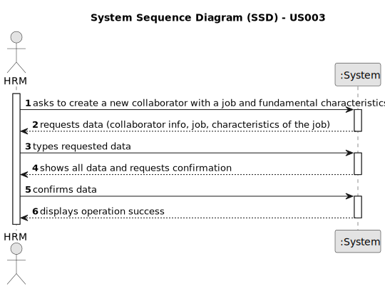
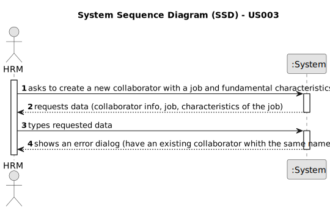

# US003 - Register a colaborator with a job and fundamental characteristics

## 1. Requirements Engineering

### 1.1. User Story Description

As a Human Resources Manager, I want to register a collaborator with a job and fundamental characteristics.

### 1.2. Customer Specifications and Clarifications 

**From the specifications document:**

>   Each  collaborator is charecterized by a name, a birthdate, admission date, an address, contact (email or phone number), an identification document and its identification number.

**From the client clarifications:**

> **Question:** The term "fundamental characteristics" is mentioned in US003. What, precisely, are those characteristics?
>
> **Answer:** The essencial data are name, birthdate, admission date, address, contact (email or phone number), an identification document and its identification number.

> **Question:** Which information is mandatory to insert a collaborator in the program (fundamental characteristics)?
>
> **Answer:** name, birth date, admission date, address, contact info (mobile and email), taxpayer number, ID doc type and respective number.

> **Question:** Does the HRM select the job from a list that we display?
> 
> **Answer:**  displaying or not, It's a matter of UX, the dev team should decide about it, but the valid jobs are the ones created within the US02.

### 1.3. Acceptance Criteria

* **AC1:** All required fields must be filled in.
* **AC2:** Every collaborator must have an associated job.
* **AC3:** Name, birthdate, admission date, adress, contact info (mobile and e-mail), ID doc type, ID number.

### 1.4. Found out Dependencies

* There is a dependency on "US002 - Register a Job" as there must be a job to associate to every collaborator.

### 1.5 Input and Output Data

**Input Data:**

* Typed data:
    * Name
    * Birthdate 
    * Address
    * Admission date
    * Contact info (mobile and e-mail)
    * Identification document
    * Identification document number
	
* Selected data:
    * a Job

**Output Data:**

* Colaborator and it's job associated 
* (In)Success of the operation

### 1.6. System Sequence Diagram (SSD)

**_Other alternatives might exist._**

#### Alternative One

#### Alternative Two

### 1.7 Other Relevant Remarks

* None 