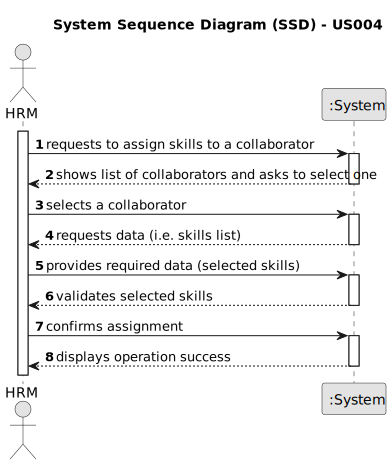

# US004 - Assign Skills to a Collaborator

## 1. Requirements Engineering

### 1.1. User Story Description

As a Human Resources Manager (HRM), I want to assign one or more skills to a collaborator.

### 1.2. Customer Specifications and Clarifications 

**From the specifications document:**

>	A collaborator should be able to be assigned one or more skills from a predefined list. 

**From the client clarifications:**

> **Question:** How are skills assigned to collaborators?
>
> **Answer:** The HRM selects from a list of previously defined skills and associates them with a collaborator's profile.

### 1.3. Acceptance Criteria

* **AC1:** The HRM must be able to select and assign one or more skills to a collaborator.
* **AC2:** The system should display an error message if the HRM tries to assign a skill that does not exist in the predefined list of skills.
* **AC3:** Once assigned, the system should update the collaborator's profile with the assigned skills.

### 1.4. Found out Dependencies

* There is a dependency on "US001 - Register a skill" as the skill must first be registered in the system before being possible to assign it to a collaborator.

### 1.5 Input and Output Data

**Input Data:**

* Typed data:
    * none
	
* Selected data:
    * Skills to be assigned to the collaborator 

**Output Data:**

* List of skills assigned to the collaborator
* (In)Success of the operation

### 1.6. System Sequence Diagram (SSD)

**_Other alternatives might exist._**

#### Alternative One

#### Alternative Two

### 1.7 Other Relevant Remarks

* Provide search or filtering options for the list of skills to expedite the selection process.
* Implement appropriate permissions and access controls to restrict the ability to assign skills to authorized HRM users only.
* Provide feedback upon successful assigment of skills, confirming the completion of the operation.