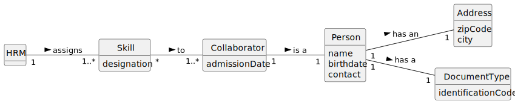

# US004 - Assign Skills to a Collaborator

## 2. Analysis

### 2.1. Relevant Domain Model Excerpt 

### 2.2. Other Remarks

- All the dates used (date of admission and date of birth) are in European format (day/month/year).
- The zip code should only be filled in with numbers and must be followed by the respective city.
- The contact is a telephone contact, so it will have 9 digits, as the programme is being designed primarily for Portugal (+351).
- The identification code can be filled in by numbers or letters, depending on the document type.