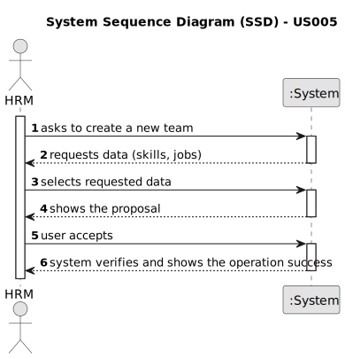
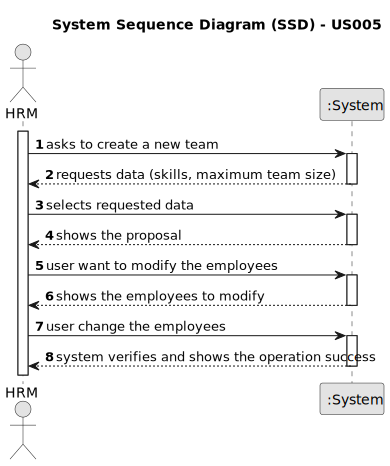
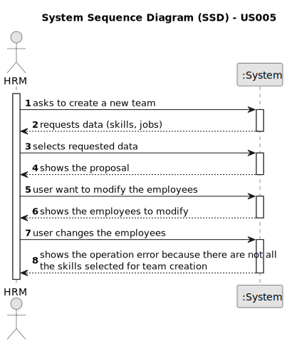

# US005 - Generate a team

## 1. Requirements Engineering

### 1.1. User Story Description

As an HRM, I want to generate a team proposal automatically.

### 1.2. Customer Specifications and Clarifications 

**From the specifications document:**

>	At the touch of a button, HRM wants to create a team proposal that meets your needs. To do this, it will ask for the competences that this team must have, and the number of persons.

**From the client clarifications:**

> **Question:** Should the user (HRM) be warned if skills are missing?
>
> **Answer:** The programme makes suggestions for teams and the manager can modify or reject them. The programme should warn of the lack of skills in its changes (or in the modification it simply doesn't show the employees who don't have the skills of the person being changed).

### 1.3. Acceptance Criteria

* **AC1:** There must be at least one competence.
* **AC2:** A team name must be assigned.

### 1.4. Found out Dependencies

* US001, US002, US003, US004 are fundamental dependencies for this functionality to work correctly.

### 1.5 Input and Output Data

**Input Data:**

* Typed data:
    * a designation to the team

* Selected data:
    * the skills needed
    * number of collaborators

**Output Data:**

* List of collaborators
* (In)Success of the operation

### 1.6. System Sequence Diagram (SSD)

**_Other alternatives might exist._**

#### Alternative One

#### Alternative Two

#### Alternative Three

### 1.7 Other Relevant Remarks

* Once the generated list of employees has been displayed, HRM may want to change someone. After this change, the programme must check that the competences selected initially are present in the team change.
* The generated team is stored until it is dismantled by the human resources manager.