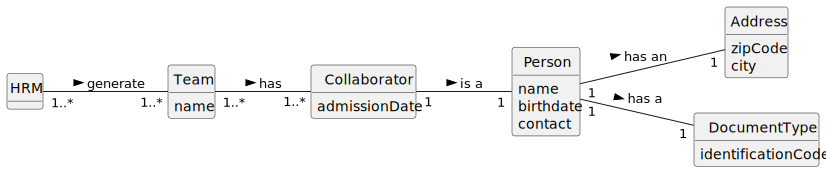

# US005 - Generate a team 

## 2. Analysis

### 2.1. Relevant Domain Model Excerpt 

### 2.2. Other Remarks

All dates used (Admission date and Birthdate) used are in the European format (day/month/year).

The zip code should only be filled in with numbers and must be followed by the respective city.

The identification code can be filled in by numbers or letters, depending on the document type.