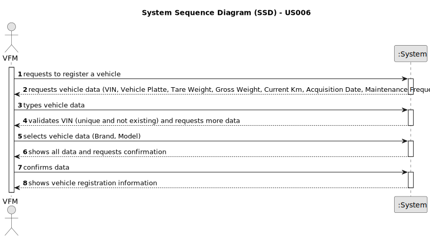

# US006 - Register a Vehicle

## 1. Requirements Engineering

### 1.1. User Story Description

As a floor manager (FM), I wish to register a vehicle including all the attributes.
### 1.2. Customer Specifications and Clarifications 

**From the specifications document:**

>   To register a vehicle is required some attributes. The person who register the vehicles is the floor manager (FM) and the vehicle is saved by in system. 
>  All the listed vehicle registration attributes are mandatory for successful registration. The system should not allow registration with missing information.
>  Floor Managers can modify existing vehicle registration information.
 
**From the client clarifications:**

> **Question:** To register a vehicle is necessary all attributes ?
> 
> **Answer:** Yes. To register a vehicle in the system, is request every attribute, in other case, the system should reject.

### 1.3. Acceptance Criteria

* **AC1:** All atributes must be filled.
* **AC2:** The system must validate the VIN to ensure it is unique and corresponds to a non-registered vehicle.
* **AC3:** When registering a vehicle already register, the system must reject such operation and the floor manager (FM) must be able to modify some attribute.
* **AC4:** The system must securely store the registered vehicle information.

### 1.4. Found out Dependencies

* There is a no dependency on others users stories.

### 1.5 Input and Output Data

**Input Data:**

* Typed data:
    * Vehicle identification number (VIN)
    * Brand
    * Model
    * Tare Weight (weight of the empty vehicle)
    * Gross weight (maximum weight of the loaded vehicle)
    * Current Kilometer Reading
    * Registration Date
    * Acquisition Date
    * Checkup Frequency (in Kilometers)
	
* Selected data:
    * Type (car, truck, etc.)

**Output Data:**

* (In)Success of the operation
* List of existing vehicle registration information (for viewing or updating).

### 1.6. System Sequence Diagram (SSD)

**_Other alternatives might exist._**

#### Alternative One

#### Alternative Two

### 1.7 Other Relevant Remarks

* None