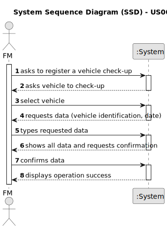
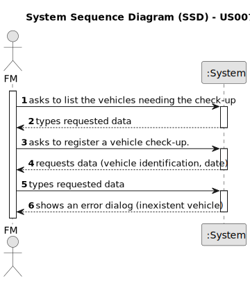

# US007 - Register vehicle check-up

## 1. Requirements Engineering

### 1.1. User Story Description

As a fleet manager (FM), I wish to register a vehicle's checkup.

### 1.2. Customer Specifications and Clarifications 

**From the specifications document:**

>	Each vehicle should have a first checkup date and a frequency associated. 

**From the client clarifications:**

> **Question:** Which is the unit of measurement used to estimate the frequency of the checkups? (months, kilometers, etc...)
>
> **Answer:** Duration is estimated in kilometers or months.

> **Question:** 
>
> **Answer:** 

### 1.3. Acceptance Criteria

* **AC1:** All required fields must be filled in.
* **AC2:** Every vehicle should have a checkup date associated.
* **AC3:** When creating a checkup, the vehicle should not have a checkup scheduled within the frequency time. 

### 1.4. Found out Dependencies

* There is a dependency on "US008 - Register a vehicle" as there must be a vehicle existent to associate a checkup.

### 1.5 Input and Output Data

**Input Data:**

* Typed data:
    * a date
	
* Selected data:
    * a vehicle

**Output Data:**

* The vehicle and the date of the checkup.
* (In)Success of the operation

### 1.6. System Sequence Diagram (SSD)

**_Other alternatives might exist._**

#### Alternative One

#### Alternative Two

### 1.7 Other Relevant Remarks

* None