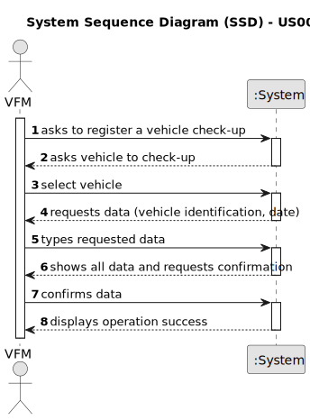

# US007 - Register vehicle check-up

## 1. Requirements Engineering

### 1.1. User Story Description

As a fleet manager (FM), I wish to register a vehicle's checkup.

### 1.2. Customer Specifications and Clarifications 

**From the specifications document:**

>	Each vehicle should have a first checkup date and a frequency associated in Km. 

**From the client clarifications:**

> **Question:** What is the unit of measurement used to estimate the check-up frequency (Kms, months, etc.)?
>
> **Answer:** In real context all could be considered, in the scope of this project just Kms will be considered.

> **Question:** What information is needed when registering a vehicle for check up?
>
> **Answer:** Vehicle ID, Date and Kms at check-up.

> **Question:** After register a job/vehicle's checkup should a message (sucess or failure) or a resume of the register appear?
>
> **Answer:** The UX/UI is up to the dev teams.

> **Question:** Does a vehicle need to be registered in US06 before being able to go for a check-up in US007?
> 
> **Answer:** Yes.

> **Question:** Can a vehicle not have a check-up?
>
> **Answer:** Yes.

> **Question:**  What´s the supposed vehicle check up supposed to look like?
>
> **Answer:** Yes.

### 1.3. Acceptance Criteria

* **AC1:** All required fields must be filled in.
* **AC2:** Every vehicle should have a checkup frequency associated.
* **AC3:** When creating a checkup, the vehicle should not have a checkup scheduled within the estimated frequency. 

### 1.4. Found out Dependencies

* There is a dependency on "US006 - Register a vehicle" as there must be a vehicle existent to associate a checkup.

### 1.5 Input and Output Data

**Input Data:**

* Typed data:
    * Date of the check-up
	
* Selected data:
    * Vehicle

**Output Data:**

* The vehicle and the date of the checkup.
* (In)Success of the operation

### 1.6. System Sequence Diagram (SSD)

**_Other alternatives might exist._**

#### Alternative One

### 1.7 Other Relevant Remarks

* None