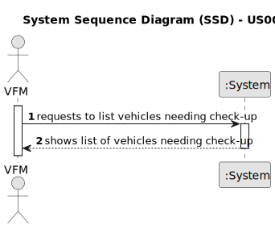

# US008 - List Vehicles Needing Check-up 

## 1. Requirements Engineering

### 1.1. User Story Description

As a Facilities Manager (FM), I want to list the vehicles that are due for a check-up.

### 1.2. Customer Specifications and Clarifications 

**From the specifications document:**

>	The system should provide a list of vehicles that need maintenance or check-up based on their maintenance/checkup frequency and current kilometers. 

**From the client clarifications:**

> **Question:** How should the system determine which vehicles need check-up?
>
> **Answer:** The system should compare the current kilometers of each vehicle with their maintenance/checkup frequency to determine if a check-up is due.

### 1.3. Acceptance Criteria

* **AC1:** The system should generate a list of vehicles that are due for a check-up based on their maintenance/checkup frequency and current kilometers.
* **AC2:** The list should include relevant information such as vehicle ID, brand, model, and current kilometers.
* **AC3:** The list should be easily accessible to the Facilities Manager.
* **AC4:** The system should allow filtering or sorting options for the list based on different criteria, such as vehicle brand or check-up due date.

### 1.4. Found out Dependencies

* There is a dependency on "US006 - Register a Vehicle" - The ability to list vehicles needing check-up depends on the vehicles being registered in the system with relevant information such as current kilometers and maintenance/checkup frequency.
* There is a dependency on "US007 - Register Vehicle Check-up" - The ability to list vehicles needing check-up depends on the registration of vehicle check-ups. This allows the system to track when the last check-up was performed and determine if a vehicle is due for maintenance based on its maintenance/checkup frequency.

### 1.5 Input and Output Data

**Input Data:**

* None

**Output Data:**

* List of vehicles needing check-up
* Relevant vehicle information (e.g., ID, brand, model, current kilometers)
* (In)Success of the operation

### 1.6. System Sequence Diagram (SSD)

**_Other alternatives might exist._**

#### Alternative One

#### Alternative Two

### 1.7 Other Relevant Remarks

* Implement appropriate logic to determine the vehicles needing check-up based on maintenance/checkup frequency and current kilometers.
* Ensure that the generated list is accurate and up-to-date.
* Consider providing notifications or alerts to the Facilities Manager for vehicles approaching or overdue for check-up.
* Provide user-friendly interface with intuitive navigation and filtering options for easy access to the list of vehicles needing check-up.