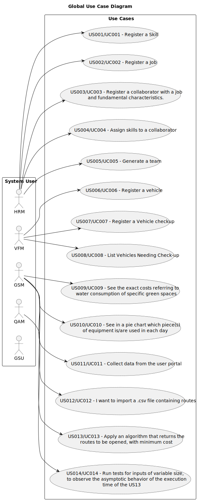

# Use Case Diagram (UCD)

**In the scope of this project, there is a direct relationship of _1 to 1_ between Use Cases (UC) and User Stories (US).**

This is the global Use Case Diagram and shows the main functions of the main roles in the application:

**For each Use Case/User Story (UC/US), evidence is provided below of the application of the main activities of the software development process (requirements, analysis, design, testing and code).**

# Use Cases / User Stories

| UC/US | Description                                                                                                                                  |                   
|:------|:---------------------------------------------------------------------------------------------------------------------------------------------|
| US001 | [Register a Skill](../../us001/Readme.md)                                                                                                    |
| US002 | [Register a Job](../../us002/Readme.md)                                                                                                      |
| US003 | [Register a collaborator with a job and fundamental characteristics.](../../us003/Readme.md)                                                 |
| US004 | [Assign Skills](../../us004/Readme.md)                                                                                                       |
| US005 | [Generate a team](../../us005/Readme.md)                                                                                                     |
| US006 | [Register a Vehicle](../../us006/Readme.md)                                                                                                  |
| US007 | [Register a vehicle´s check-up](../../us007/Readme.md)                                                                                       |
| US008 | [Listing vehicles needing check-up](../../us008/Readme.md)                                                                                   |
| US009 | [Know the exact costs referring to water consumption of specific green space](../../us009/Readme.md)                                         |
| US010 | [Know which piece(s) of equipment is/are used in each day](../../us010/Readme.md)                                                            |
| US011 | [Collect data from the user portal about the use of the park](../../us011/Readme.md)                                                         |
| US012 | [Import a .csv file containing lines](../../us012/Readme.md)                                                                                 |
| US013 | [Apply an algorithm that returns the routes to be opened and pipes needed to be laid with a minimum accumulated cost](../../us013/Readme.md) |
| US014 | [Run tests for inputs of variable size](../../us014/Readme.md)                                                                               |
