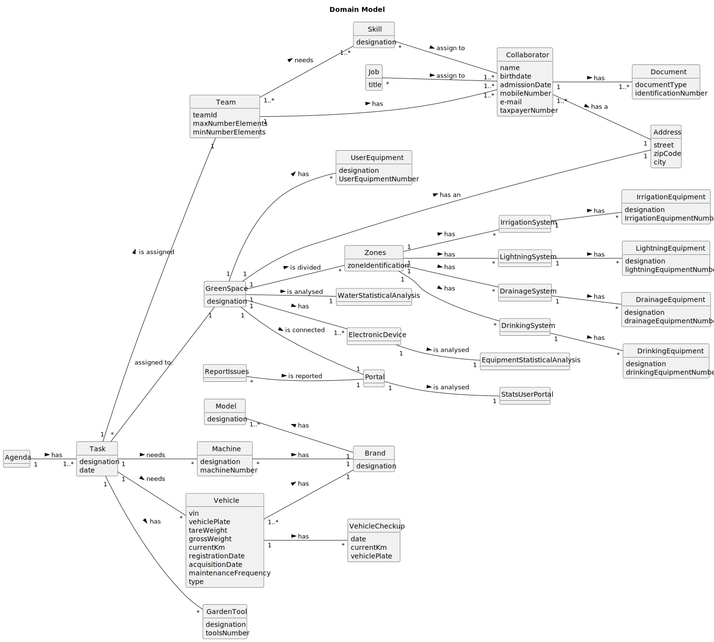

# OO Analysis

The construction process of the domain model is based on the client specifications, especially the nouns (for _concepts_)
and verbs (for _relations_) used.

## Rationale to identify domain conceptual classes
To identify domain conceptual classes, start by making a list of candidate conceptual classes inspired by the list of 
categories suggested in the book "Applying UML and Patterns: An Introduction to Object-Oriented Analysis and Design and 
Iterative Development".

### _Conceptual Class Category List_

**Business Transactions**

* Employees
* Vehicles
* Equipments

---

**Transaction Line Items**

* Checkup
* Tasks
* Maintenance activities

---

**Product/Service related to a Transaction or Transaction Line Item**

* Plant Materials
* Furniture
* Equipment
* Vehicles
* Machines

---

**Transaction Records**

* Agenda
* Work Logs
* Checkup Register

---  

**Roles of People or Organizations**

* HRM - Human Resources Manager
* VFM - Vehicle and Equipment Fleet Manager
* GSM - Green Spaces Manager
* QAM - Software Quality Assessment Team Manager
* GSU - Green Spaces User
* CLB - Collaborator

---

**Places**

* Green Spaces
* Garages

---

**Noteworthy Events**

* Checkup
* Team formation
* Task 

---

**Physical Objects**

* Vehicles
* Machines
* Gardening Equipment

---

**Descriptions of Things**

* Job descriptions
* Skill sets

---

**Catalogs**

* Skills catalog
* Job catalog
* Vehicle catalog

---

**Containers**

* Teams

---

**Elements of Containers**

* Team Members

---

**Organizations**

* MS - MusgoSublime

---

**Other External/Collaborating Systems**

* User Portal

---

**Records of finance, work, contracts, legal matters**

* Admission date

---

**Financial Instruments**

* None -------------

---

**Documents mentioned/used to perform some work/**

* Reports
* Comments

---

## Rationale to identify associations between conceptual classes

An association is a relationship between instances of objects that indicates a relevant connection and that is worth of 
remembering, or it is derivable from the List of Common Associations:

- **_A_** is physically or logically part of **_B_**
- **_A_** is physically or logically contained in/on **_B_**
- **_A_** is a description for **_B_**
- **_A_** known/logged/recorded/reported/captured in **_B_**
- **_A_** uses or manages or owns **_B_**
- **_A_** is related with a transaction (item) of **_B_**
- etc.

| Concept (A) 		    | Association   	 |                    Concept (B) |
|-------------------|:---------------:|-------------------------------:|
| Agenda            |       has       |                           Task |
| Task              |    can have     |                    Garden Tool |
| Task              |      needs      |                        Vehicle |
| Task              |      needs      |                       Machines |
| Task              |    assign to    |                    Green Space |
| Task              |    assign to    |                           Team |
| Vehicle           |       has       |                          Brand |
| Vehicle           |       has       |                       Check-up |
| Machine           |       has       |                          Brand |
| Brand             |       has       |                          Model |
| Green Space       |       has       |                 User Equipment |
| Green Space       |       has       |                        Address |
| Green Space       |   is divided    |                          Zones |
| Zones             |    can have     |               Lightning System |
| Zones             |    can have     |              Irrigation System |
| Zones             |    can have     |                Drainage System |
| Zones             |    can have     |                Drinking System |
| Lightning system  |      have       |            Lightning Equipment |
| Irrigation system |      have       |           Irrigation Equipment |
| Drainage system   |      have       |             Drainage Equipment |
| Drinking system   |      have       |             Drinking Equipment |
| Green Space       |   is analyzed   |     Water Statistical Analysis |
| Green Space       |       has       |              Electronic Device |
| Electronic Device |   is analyzed   | Equipment Statistical Analysis |
| Green Space       |  is connected   |                         Portal |
| Portal            |   is analyzed   |              Stats User Portal |
| Report Issues     |   is reported   |                         Portal |
| Team              |      needs      |                          Skill |
| Skill             |       to        |                   Collaborator |
| Team              |       has       |                   Collaborator |
| Collaborator      |       has       |                            Job |
| Collaborator      |       has       |                       Document |
| Collaborator      |       has       |                        Address |
| Collaborator      |   assigned to   |                           Team |
| GSU               | interacts with  |                    User Portal |
| GSU               | interacts with  |              Electronic Device |

## Domain Model

