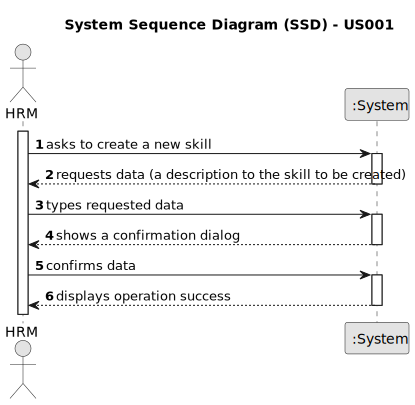

# US001 - Register a Skill

## 1. Requirements Engineering

### 1.1. User Story Description

As a Human Resources Manager (HRM), I want to register skills that may
be appointed to a collaborator.

### 1.2. Customer Specifications and Clarifications

**From the specifications document:**

> A skill created should be saved in a skills list so that it can be assigned to one or more collaborators in the future.

**From the client clarifications:**

> **Question:** Will a list of competences be provided?
>
> **Answer:** No. The Human Resources Manager defines it and the system saves it for later association with a profile.

> **Question:** Which information can be introduced to create a new skill?
>
> **Answer:** The skill name;

> **Question:** Which information is mandatory for creating a new skill?
>
> **Answer:** The skill name;

> **Question:** Which are the skills accepted? Or should we enable the HRM to introduce anything as a skill?
>
> **Answer:** All, it's up to HRM to decide. (special characters or algarisms should not be allowed in the skill name)

> **Question:** Do I need to add skills by writing them or can I just give a file with all of the skills?
>
> **Answer:** Both are acceptable since the business the same the crucial difference resides in the UX.

> **Question:** Does the HRM need to see the confirmation of the success of the operation and the skills added or just
> the success of the operation?
>
> **Answer:** It will depend on if you opt to insert one skil or a set of skils in a batch. Maybe some adaptation needed.

> **Question:** Is there any other possible outcome like if the HMR does not put the requested data, do I need to ask
> the user to register a different competence?
>
> **Answer:** This US is quite simple, atm a skill is simply a name.

> **Question:** What criteria are needed to register a skill?
>
> **Question:** What kind of information does a skill have?
>
> **Answer:** the name of the skill, for example: pruner; lorry driver; phytopharmaceutical applicator

> **Question:** When you create a skill that already exists, what should the system do?
>
> **Answer:** By definition it is not possible to have duplicate values in a set. Checking for duplicates is not a
> business rule, it's a technology rule.

> **Question:** Should the system able the HRM to introduce multiple skills in one interaction before saving all of them?
>
> **Answer:** It's not required to do so.

> **Question:** The indentificator of the skill will be the name, or the system will generate authomatically and Id when the manager insert the name?
> 
> **Answer:** A skill is just a name, can be a composition os words like "Light Vehicle Driving Licence". I have no knowledge about systems IDs.

> **Question:** Dear client, which is the difference between collaborator and employ? And employ could have skills? HRM, VFM, GSM and GSU are employers?
>
> **Answer:** Employee and collaborator are synonyms.

### 1.3. Acceptance Criteria

* **AC1:** All skill field must be filled in.
* **AC2:** If you create a skill with the same name as an existing skill, the system should show an information window
  and reject the skill.

### 1.4. Found out Dependencies

* None.

### 1.5 Input and Output Data

**Input Data:**

* Typed data:
    * a designation

* Selected data:
    * none

**Output Data:**

* (In)Success of the operation

### 1.6. System Sequence Diagram (SSD)

**_Other alternatives might exist._**

#### Alternative One

### 1.7 Other Relevant Remarks

* Implement appropriate permissions and access controls to restrict the ability to register a skill to authorized HRM users only.