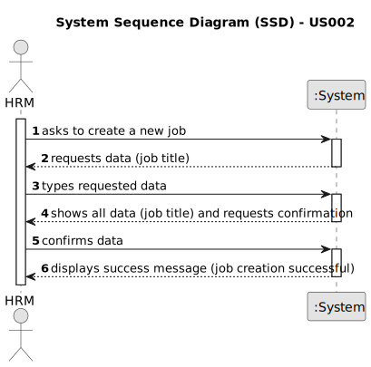

# US002 - Register a Job 

## 1. Requirements Engineering

### 1.1. User Story Description

As a Human Resources Manager (HRM), I want to register a job that a collaborator needs to have.

### 1.2. Customer Specifications and Clarifications 

**From the specifications document:**

> A Job needed is submitted by the Human Resources Manager (HRM) and saved by the system as an option.

**From the client clarifications:**

> **Question:** Will a list of jobs be provided ?
>
> **Answer:** No. The Human Resources Manager (HRM) defines it and the system will save it as an option for the future.

> **Question:** What are the input data for creating a profession?
>
> **Answer:** Profession name.

> **Question:** When are creating a job that already exit, what the system do?
>
> **Answer:** By definition a set can´t have duplicates. Assuring no duplicates is not a business rule is a technical issue.

> **Question:** Is it relevant to associate a specific area or sector with each Job? (For example, "Gardener" would be placed in the "Maintenance" sector)
>
> **Answer:** it is not necessary as there are no US that suggest that this might be necessary;

> **Question:** Should information such as salary, type of employment (full-time or part-time), and type of work (in-person, remote or hybrid) be included in the Job? Or does this information fit better within the scope of the employee, or perhaps it is not even necessary?
>
> **Answer:** idem.

> **Question:** What other information do you think is necessary to associate with the Job?
>
> **Answer:** None for now.

> **Question:** Can special characters and numbers be entered when registering a job?
> 
> **Answer:** No.

> **Question:** I assume that a job name cannot be empty. Is that right?
> 
>  **Answer:** That's right.

### 1.3. Acceptance Criteria

* **AC1:** The job field must be filled in.
* **AC2:** A job name can’t have special characters or digits.
* **AC3:** If a job is created with the same name as an existing job, the system should show an information window
  and reject the job.

### 1.4. Found out Dependencies

* None.

### 1.5 Input and Output Data

**Input Data:**

* Typed data:
    * Job title

* Selected data:
  * None

**Output Data:**
* (In)Success of the operation

### 1.6. System Sequence Diagram (SSD)

**_Other alternatives might exist._**

#### Alternative One

### 1.7 Other Relevant Remarks

* Implement appropriate permissions and access controls to restrict the ability to register a job to authorized HRM users only.