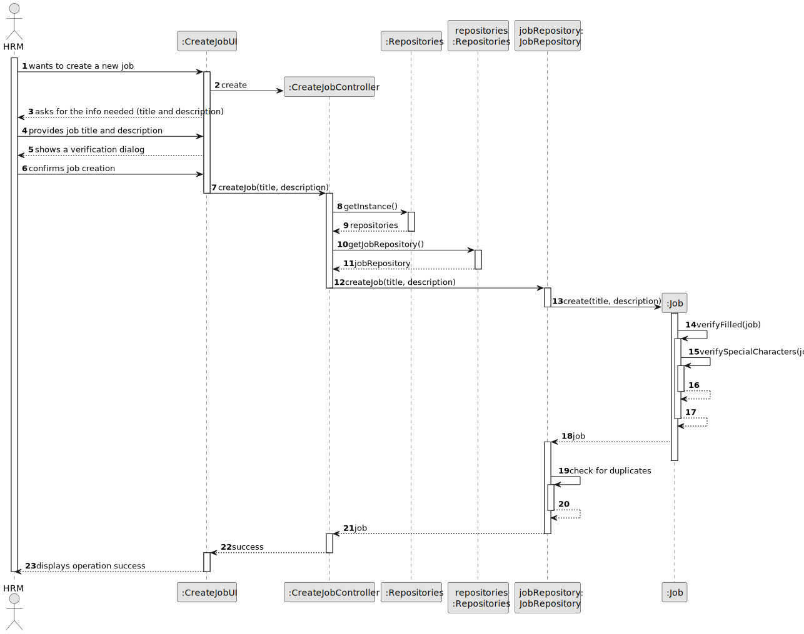
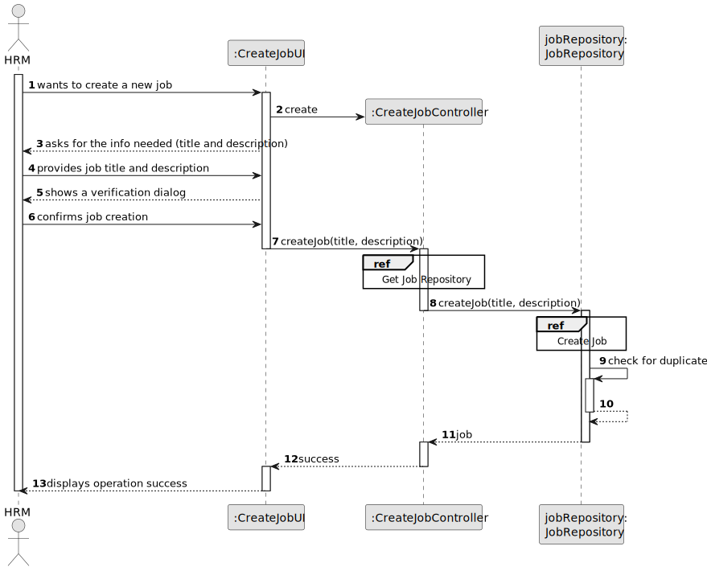
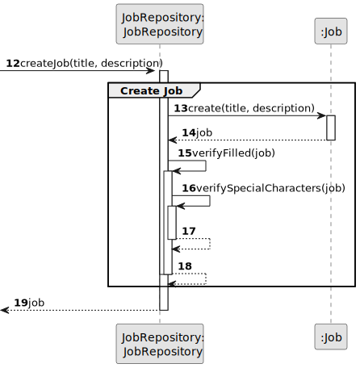
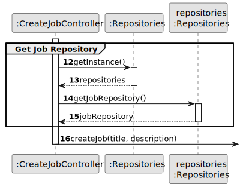
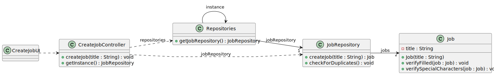

# US002 - Create a Job 

## 3. Design - User Story Realization 

### 3.1. Rationale

_**Note that SSD - Alternative One is adopted.**_

| Interaction ID | Question: Which class is responsible for...   | Answer                              | Justification (with patterns)                                                                                 |
|:---------------|:----------------------------------------------|:------------------------------------|:--------------------------------------------------------------------------------------------------------------|
| Step 1  		     | 	... interacting with the actor?              | CreateJobUI                         | Pure Fabrication: there is no reason to assign this responsibility to any existing class in the Domain Model. |
| 		             | 	... coordinating the US?                     | CreateJobController                 | Controller                                                                                                    |
| 	  		          | 	... instantiating a new Job?                 | JobRepository                       | Repository Pattern                                                                                            |
| 	  		          | ... knowing the user using the system?        | N/A                                 | N/A                                                                                                           | 
| Step 2  		     | 	...saving the inputted data?                 | CreateJobUI and CreateJobController | MVC (Model-View-Controller)                                                                                   |
| Step 3  		     | 	... saving the job?                          | JobRepository                       | Repository                                                                                                    |
| Step 4  		     | 	... validating all data (global validation)? | JobRepository                       | ??                                                                                                            | 
| Step 5  		     | 	... informing operation success?             | CreateJobUI                         | Is responsible for user interactions.                                                                         | 

### Systematization ##

According to the taken rationale, the conceptual classes promoted to software classes are: 

* Job

Other software classes (i.e. Pure Fabrication) identified: 

* CreateJobUI  
* CreateJobController
* JobRepository

## 3.2. Sequence Diagram (SD)

_**Note that SSD - Alternative Two is adopted.**_

### Full Diagram

This diagram shows the full sequence of interactions between the classes involved in the realization of this user story.

### Split Diagrams

The following diagram shows the same sequence of interactions between the classes involved in the realization of this user story, but it is split in partial diagrams to better illustrate the interactions between the classes.

It uses Interaction Occurrence (a.k.a. Interaction Use).

**Create Job**

**Get Job Repository**

## 3.3. Class Diagram (CD)

