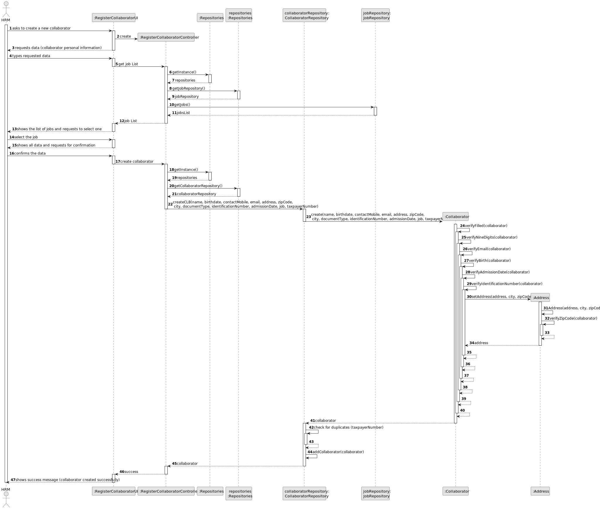
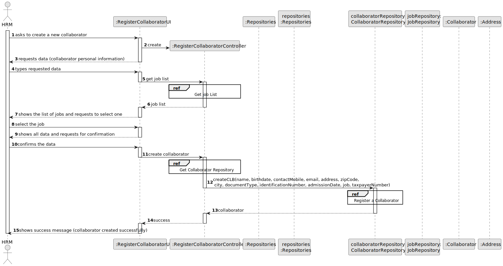
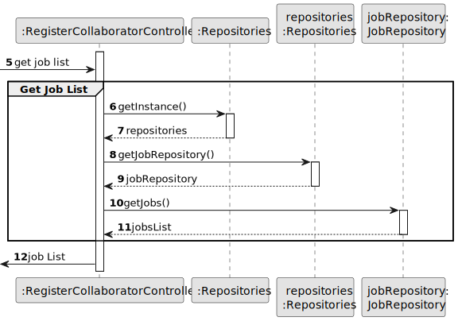
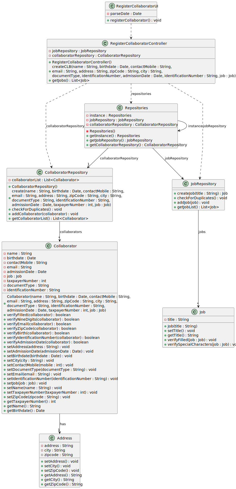

# US003 - Register a collaborator with a job and fundamental characteristics

## 3. Design - User Story Realization 

### 3.1. Rationale

_**Note that SSD - Alternative One is adopted.**_

| Interaction ID | Question: Which class is responsible for...   | Answer                         | Justification (with patterns)                                                              |
|:---------------|:----------------------------------------------|:-------------------------------|:-------------------------------------------------------------------------------------------|
|                | 	... interacting with the actor?              | RegisterCollaboratorUI         | Pure Fabrication: there is no reason to assign this responsibility to any existing class.  |
|                | 	... coordinating the US?                     | RegisterCollaboratorController | Controller  (Model-View-Controller)                                                        |
|                | 	... instantiating a new Collaborator?        | CollaboratorRepository         | Creator                                                                                    |
|                | 	...saving the inputted data?                 | Collaborator                   | Creator Pattern                                                                            |
|                | 	... validating all data (local validation)?  | Collaborator                   | Information Expert                                                                         | 
|                | 	... validating all data (global validation)? | CollaboratorRepository         | Information Expert                                                                         | 
|                | 	... saving the Collaborator?                 | CollaboratorRepository         | Repository Pattern                                                                         | 
|                | 	... informing operation success?             | RegisterCollaboratorUI         | Model-View-Controller                                                                      | 
|                | 	... handling the user selecting a job?       | RegisterCollaboratorController | Model-View-Controller                                                                      | 
|                | 	... assigning the selected job to the user?  | CollaboratorRepository         | The job is added in the creation process. So the Creator Pattern may be the most suitable. | 
|                | ... have all the repositories?                | Repositories                   | Repository Pattern                                                                         |

### Systematization ##

According to the taken rationale, the conceptual classes promoted to software classes are: 

* Job
* Collaborator

Other software classes (i.e. Pure Fabrication) identified: 

* RegisterCollaboratorUI  
* RegisterCollaboratorController
* JobRepository
* CollaboratorRepository
* Repositories

## 3.2. Sequence Diagram (SD)

_**Note that SSD - Alternative Two is adopted.**_

### Full Diagram

This diagram shows the full sequence of interactions between the classes involved in the realization of this user story.

### Split Diagrams

The following diagram shows the same sequence of interactions between the classes involved in the realization of this user story, but it is split in partial diagrams to better illustrate the interactions between the classes.

It uses Interaction Occurrence (a.k.a. Interaction Use).

**Get Collaborator Repository**

**Register a Collaborator**

**Get Job List**

## 3.3. Class Diagram (CD)

