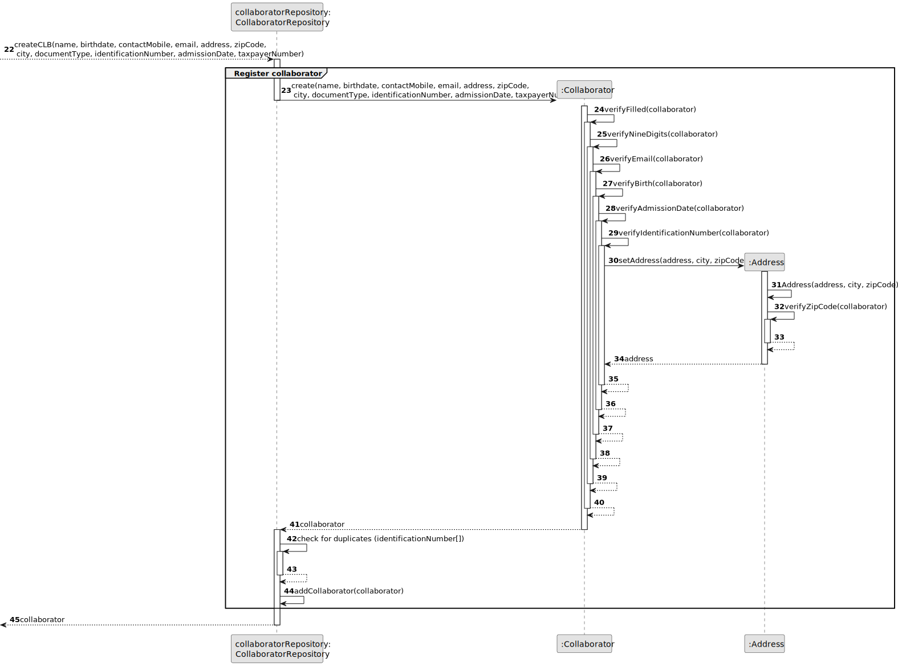

# US003 - Register a collaborator with a job and fundamental characteristics

## 3. Design - User Story Realization 

### 3.1. Rationale

_**Note that SSD - Alternative One is adopted.**_

| Interaction ID | Question: Which class is responsible for...     | Answer                         | Justification (with patterns)                                                                                 |
|:---------------|:------------------------------------------------|:-------------------------------|:--------------------------------------------------------------------------------------------------------------|
| Step 1         | 	... interacting with the actor?                | RegisterCollaboratorUI         | Pure Fabrication: there is no reason to assign this responsibility to any existing class in the Domain Model. |
|                | 	... coordinating the US?                       | RegisterCollaboratorController | Controller                                                                                                    |
|                | 	... instantiating a new Collaborator?          | CollaboratorRepository         | Creator (Rule 1): Instantiating a new Collaborator entity.                                                    |
| Step 3         | 	...saving the inputted data?                   | Collaborator                   |                                                                                                               |
| Step 7         | 	... validating all data (local validation)?    | Collaborator                   |                                                                                                               | 
|                | 	... validating all data (global validation)?   | CollaboratorRepository         |                                                                                                               | 
|                | 	... saving the Collaborator?                   | CollaboratorRepository         |                                                                                                               | 
| Step 8         | 	... informing operation success?               | CreateTaskUI                   |                                                                                                               | 
|                | 	... handling the user selecting a job?         | RegisterCollaboratorController |                                                                                                               | 
|                | 	... assigning the selected job to the user?    | Collaborator                   |                                                                                                               | 
|                | 	... handling the user selecting skills?        | RegisterCollaboratorController |                                                                                                               | 
|                | 	... assigning the selected skills to the user? | Collaborator                   |                                                                                                               | 

### Systematization ##

According to the taken rationale, the conceptual classes promoted to software classes are: 

* Job
* Collaborator

Other software classes (i.e. Pure Fabrication) identified: 

* CreateTaskUI  
* CreateTaskController
* JobRepository
* SkillsRepository
* CollaboratorRepository

## 3.2. Sequence Diagram (SD)

_**Note that SSD - Alternative Two is adopted.**_

### Full Diagram

This diagram shows the full sequence of interactions between the classes involved in the realization of this user story.

### Split Diagrams

The following diagram shows the same sequence of interactions between the classes involved in the realization of this user story, but it is split in partial diagrams to better illustrate the interactions between the classes.

It uses Interaction Occurrence (a.k.a. Interaction Use).

**Pin Job to a collaborator**

**Pin Skills to a collaborator**

**Register a collaborator**

## 3.3. Class Diagram (CD)

