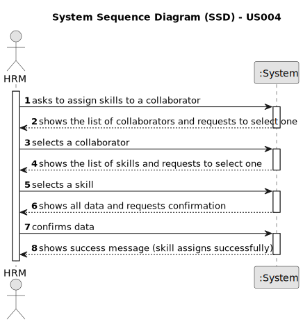

# US004 - Assign Skills to a Collaborator

## 1. Requirements Engineering

### 1.1. User Story Description

As a Human Resources Manager (HRM), I want to assign one or more skills to a collaborator.

### 1.2. Customer Specifications and Clarifications 

**From the specifications document:**

>	A collaborator should be able to be assigned one or more skills from a list of skills. 

**From the client clarifications:**

> **Question:** Can any skill be registered to any collaborator/job? Or should they be associated in categories in association with a specific job?
> 
> **Answer:** There is no association, it totally depends on the CV of the collaborator.

> **Question:** How are skills assigned to collaborators?
>
> **Answer:** The HRM selects from a list of previously defined skills and associates them with a collaborator's profile.

> **Question:** Is there a minimum or maximum number of skills a collaborator can be added to? 
>
> **Answer:** No.

> **Question:** Is there any special characteristics that the collaborator needs to have in order to have these skills added?
> 
> **Answer:** No.

> **Question:** Should it be possible to add the same skill to a collaborator multiple times?
> 
> **Answer:** That does not make sense.

> **Question:** Is there any certification/proof needed to register a skill to a collaborator?
> 
> **Answer:** No.

> **Question:** Can multiple skills be assigned to a collaborator simultaneously?
> 
> **Answer:** Yes

> **Question:**  Is there any limit to the number of skills that can be assigned to a collaborator?
> 
> **Answer:** No

> **Question:** Can a collaborator have no skills assigned?
> 
> **Answer:** Yes

### 1.3. Acceptance Criteria

* **AC1:** Once assigned, the system should update the collaborator's profile with the assigned skills.
* **AC2:** Only previously registered collaborators can be assigned skills, also previously registered.

### 1.4. Found out Dependencies

* There is a dependency on "US001 - Register a skill" as the skill must first be registered in the system before being possible to assign it to a collaborator.
* There is a dependency on "US003 - Register a collaborator" with a job and fundamental characteristics" as a collaborator must first be registered in the system before being possible to assign a skill.

### 1.5 Input and Output Data

**Input Data:**

* Typed data:
    * None
	
* Selected data:
    * Collaborator
    * Skills to be assigned to the collaborator 

**Output Data:**

* List of skills assigned to the collaborator
* (In)Success of the operation

### 1.6. System Sequence Diagram (SSD)

**_Other alternatives might exist._**

#### Alternative One

### 1.7 Other Relevant Remarks

* Provide search or filtering options for the list of skills to expedite the selection process.
* Implement appropriate permissions and access controls to restrict the ability to assign skills to authorized HRM users only.