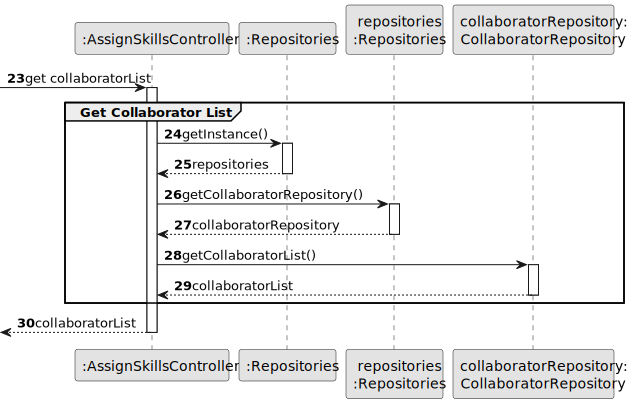
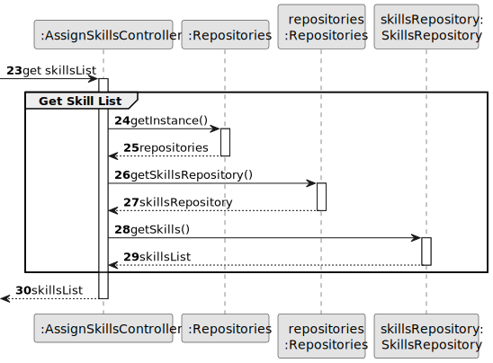

# US004 - Assign Skills to a Collaborator 

## 3. Design - User Story Realization 

### 3.1. Rationale

_**Note that SSD - Alternative One is adopted.**_

| Interaction ID | Question: Which class is responsible for...              | Answer                 | Justification (with patterns)                                                                                                                 |
|----------------|:---------------------------------------------------------|:-----------------------|-----------------------------------------------------------------------------------------------------------------------------------------------|
| Step 1         | ... interacting with the actor?                          | AssignSkillsUI         | Pure Fabrication: there is no reason to assign this responsibility to any existing class.                                                     |
|                | ... coordinating the US?                                 | AssignSkillsController | Controller: AssignSkillsController is responsible for coordinating and controlling the flow of interaction, applying the Controller pattern.  |
| Step 2         | ... requesting data?                                     | AssignSkillsUI         | Pure Fabrication: AssignSkillsUI displays the available data to be selected, promoting low coupling by separating UI logic from domain logic. |
| Step 3         | ... receiving the data?                                  | AssignSkillsUI         | Pure Fabrication.                                                                                                                             |
|                | ... get the collaborators repository?                    | Repositories           | Information Expert, High cohesion, Low coupling.                                                                                              |
|                | ... get all the collaborators and return them as a list? | CollaboratorRepository | Information Expert.                                                                                                                           |
|                | ... showing the collaborators available for selection?   | AssignSkillsUI         | Pure Fabrication.                                                                                                                             |
| Step 4         | ... handling the user selecting a collaborator?          | AssignSkillsUI         | Pure Fabrication.                                                                                                                             |
| Step 5         | ... get the skills repository?                           | Repositories           | Information Expert, High cohesion, Low coupling.                                                                                              |
|                | ... get all the skills and return them as a list?        | SkillsRepository       | Information Expert.                                                                                                                           |
|                | ... showing the skills available for selection?          | AssignSkillsUI         | Pure Fabrication.                                                                                                                             |
| Step 6         | ... handling the user selecting a skill?                 | AssignSkillsUI         | Pure Fabrication.                                                                                                                             |
| Step 7         | ... showing the confirmation info?                       | AssignSkillsUI         | Pure Fabrication.                                                                                                                             |
| Step 8         | ... validating all data (local validation)?              | Collaborator           | Information Expert                                                                                                                            |
|                | ... validating all data (global validation)?             | CollaboratorRepository | Information Expert                                                                                                                            |
|                | ... saving the updated collaborator's skills?            | CollaboratorRepository | Information Expert.                                                                                                                           |
|                | ... having all the repositories?                         | Repositories           | Information Expert, High cohesion, Low coupling.                                                                                              |
| Step 9         | ... informing of operation success?                      | AssignSkillsUI         | Pure Fabrication.                                                                                                                             |

### Systematization ##

According to the taken rationale, the conceptual classes promoted to software classes are: 

* Collaborator
* Skill
* Address

Other software classes (i.e. Pure Fabrication) identified: 

* AssignSkillsUI
* AssignSkillsController
* CollaboratorRepository
* SkillsRepository
* Repositories

## 3.2. Sequence Diagram (SD)

### Full Diagram

This diagram shows the full sequence of interactions between the classes involved in the realization of this user story.

### Split Diagrams

The following diagram shows the same sequence of interactions between the classes involved in the realization of this user story, but it is split in partial diagrams to better illustrate the interactions between the classes.

It uses Interaction Occurrence (a.k.a. Interaction Use).

**Assign Skill**

**Get Collaborator List**

**Get Skills List**

## 3.3. Class Diagram (CD)

