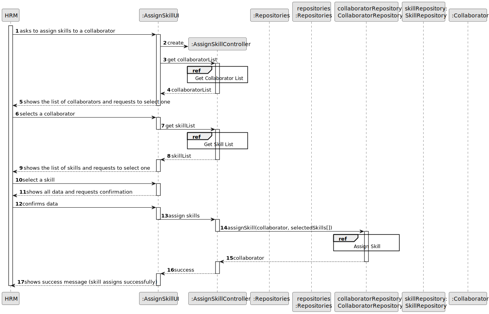
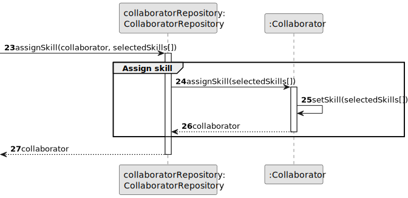

# US004 - Assign Skills to a Collaborator 

## 3. Design - User Story Realization 

### 3.1. Rationale

_**Note that SSD - Alternative One is adopted.**_

| Interaction ID | Question: Which class is responsible for...   | Answer                 | Justification (with patterns)                                                                                 |
|:-------------  |:----------------------------------------------|:-----------------------|:--------------------------------------------------------------------------------------------------------------|
| Step 1  		 | 	... interacting with the actor?              | AssignSkillsUI         | Pure Fabrication: there is no reason to assign this responsibility to any existing class in the Domain Model. |
| 			  		 | 	... coordinating the US?                     | AssignSkillsController | Controller                                                                                                    |
| 			  		 | 	... selecting skills to assign?              | skillCatalog           | Creator (Rule 1): in the DM SkillCatalog manages available skills.                                            |
| 			  		 | ... updating collaborator's profile?          | CollaboratorProfile    | IE: cf. HRM documentation.                                                                                    |
| 			  		 | 							                                       | SkillCatalog           | IE: manages available skills.                                                                                 |
| 			  		 | 							                                       | Employee               | IE: knows its own data (e.g. email)                                                                           |
| Step 2  		 | 							                                       |                        |                                                                                                               |
| Step 3  		 | 	...saving the assigned skills?               | CollaboratorProfile    | IE: object created in step 1 has its own data.                                                                |
| Step 4  		 | 	                                             |                        |                                                                                                               |
| Step 5  		 | 	... validating the assigned skills?          | CollaboratorProfile    | IE: object created in step 1 is classified in one Category.                                                   |
| Step 6  		 | 							                                       |                        |                                                                                                               |              
| Step 7  		 | 	... informing operation sucess?              | AssignSkillsUI         | IE: is responsible for user interactions.                                                                     | 
| 			  		 | 	... validating all data (global validation)? | Organization           | IE: knows all its tasks.                                                                                      | 
| 			  		 | 	... saving the created task?                 | Organization           | IE: owns all its tasks.                                                                                       | 
| Step 8  		 | 	... informing operation success?             | CreateTaskUI           | IE: is responsible for user interactions.                                                                     | 

### Systematization ##

According to the taken rationale, the conceptual classes promoted to software classes are: 

* Collaboratorprofile
* SkillCatalog

Other software classes (i.e. Pure Fabrication) identified: 

* AssignSkillsUI  
* AssignSkillsController

## 3.2. Sequence Diagram (SD)

### Full Diagram

This diagram shows the full sequence of interactions between the classes involved in the realization of this user story.

### Split Diagrams

The following diagram shows the same sequence of interactions between the classes involved in the realization of this user story, but it is split in partial diagrams to better illustrate the interactions between the classes.

It uses Interaction Occurrence (a.k.a. Interaction Use).

**Assign Skill**

## 3.3. Class Diagram (CD)

