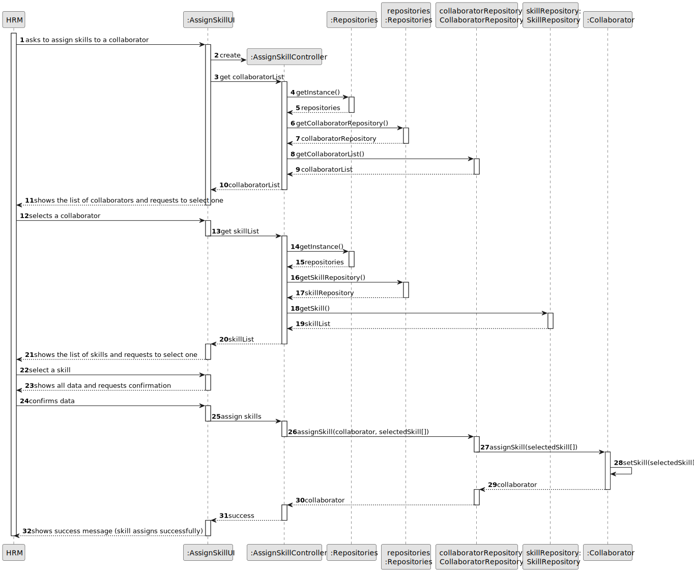
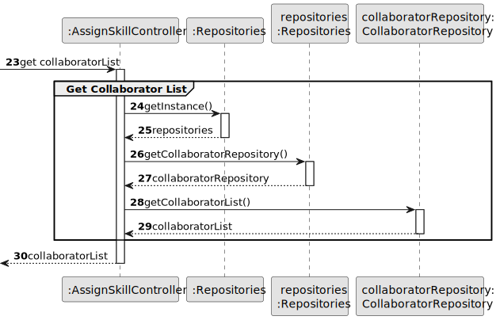
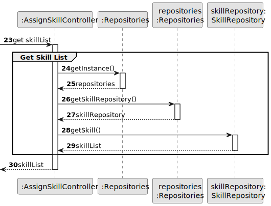
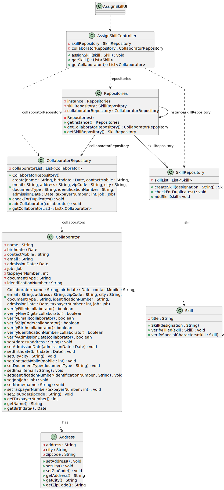

# US004 - Assign Skills to a Collaborator 

## 3. Design - User Story Realization 

### 3.1. Rationale

_**Note that SSD - Alternative One is adopted.**_

| Interaction ID | Question: Which class is responsible for...          | Answer                 | Justification (with patterns)                                                             |
|----------------|:-----------------------------------------------------|:-----------------------|-------------------------------------------------------------------------------------------|
|                | ... interacting with the actor?                      | AssignSkillsUI         | Pure Fabrication: there is no reason to assign this responsibility to any existing class. |
|                | ... coordinating the US?                             | AssignSkillsController | Controller (Model View Controller)                                                        |
|                | ... displaying list of collaborators?                | CollaboratorRepository | Information Expert                                                                        |
|                | ... displaying list of available skills?             | SkillsRepository       | Information Expert                                                                        |
|                | ... saving the selected data?                        | Collaborator           | Creator                                                                                   |
|                | ... validating all data (local validation)?          | Collaborator           | Information Expert                                                                        |
|                | ... validating all data (global validation)?         | CollaboratorRepository | Information Expert                                                                        |
|                | ... saving the updated collaborator's skills?        | CollaboratorRepository | Repository Pattern                                                                        |
|                | ... informing of operation success?                  | AssignSkillsUI         | Model-View-Controller                                                                     |
|                | ... having all the repositories?                     | Repositories           | Repository Pattern                                                                        |
|                | ... assigning the selected skills to a collaborator? | CollaboratorRpository  | Creator                                                                                   |
|                | ... handling the user selecting a job?               | AssignSkillsController | Model-View-Controller                                                                     |
|                |                                                      |                        |                                                                                           |
|                |                                                      |                        |                                                                                           |
|                |                                                      |                        |                                                                                           |

### Systematization ##

According to the taken rationale, the conceptual classes promoted to software classes are: 

* Collaborator

Other software classes (i.e. Pure Fabrication) identified: 

* AssignSkillsUI
* AssignSkillsController
* CollaboratorRepository
* SkillsRepository
* Repositories

## 3.2. Sequence Diagram (SD)

### Full Diagram

This diagram shows the full sequence of interactions between the classes involved in the realization of this user story.

### Split Diagrams

The following diagram shows the same sequence of interactions between the classes involved in the realization of this user story, but it is split in partial diagrams to better illustrate the interactions between the classes.

It uses Interaction Occurrence (a.k.a. Interaction Use).

**Assign Skill**

**Get Collaborator List**

**Get Skills List**

## 3.3. Class Diagram (CD)

