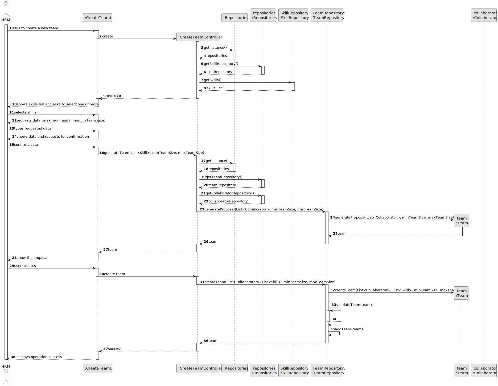
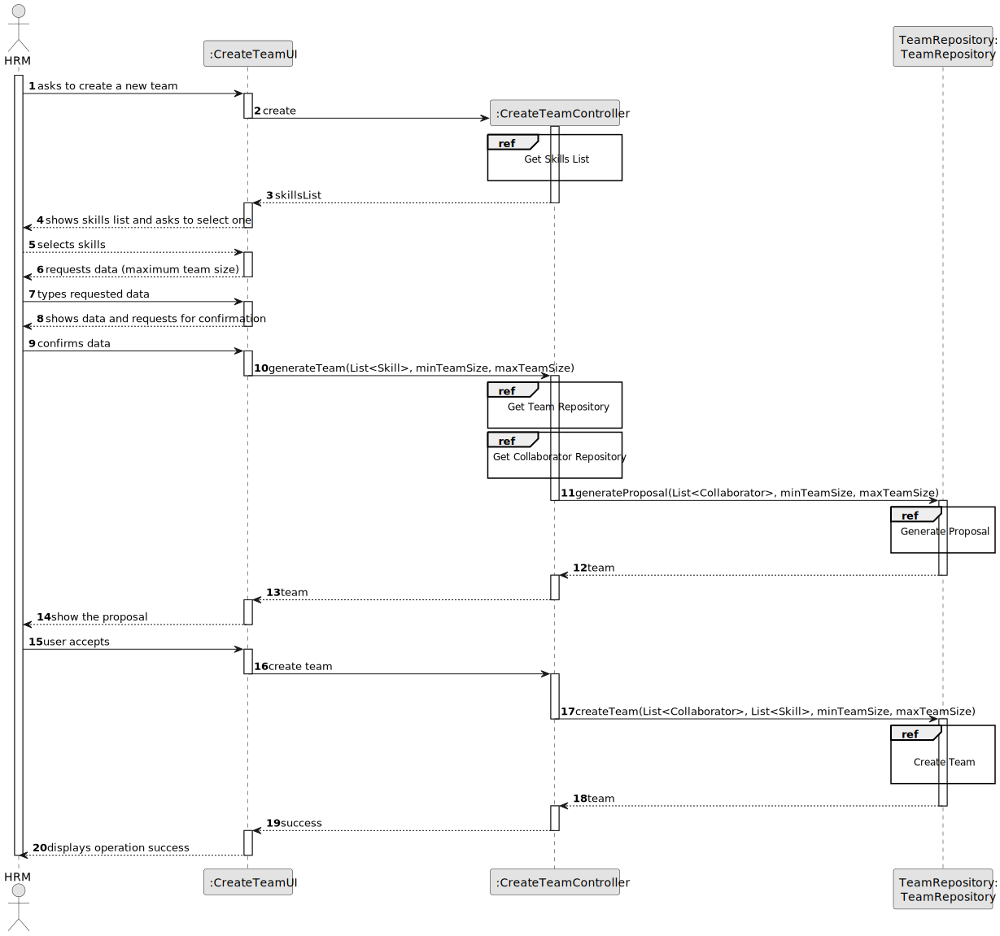
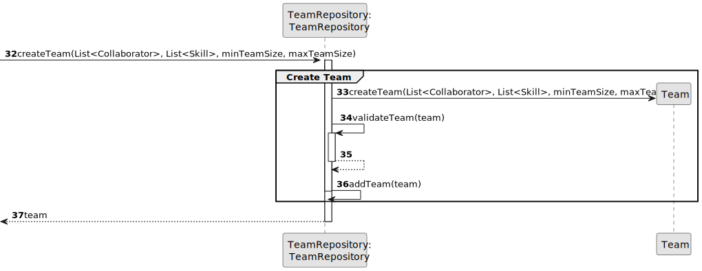
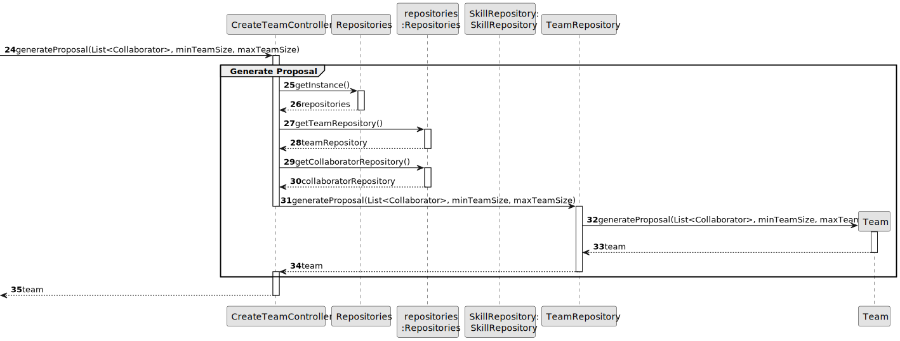
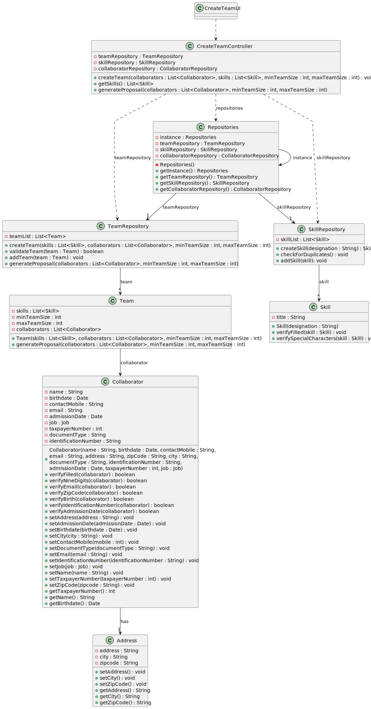

# US005 - Generate a team

## 3. Design - User Story Realization 

### 3.1. Rationale

_**Note that SSD - Alternative One is adopted.**_

| Interaction ID  | Question: Which class is responsible for...     | Answer               | Justification (with patterns)                                                             |
|:----------------|:------------------------------------------------|:---------------------|:------------------------------------------------------------------------------------------|
| Step 1  		      | 	... interacting with the actor?                | CreateTeamUI         | Pure Fabrication: there is no reason to assign this responsibility to any existing class. |
| 			  	          | 	... coordinating the US?                       | CreateTeamController | Controller                                                                                |
|                 | ... get the skills list?                        | SkillRepository      | Information Expert.                                                                       |
| Step 2          | ... requesting data?                            | CreateTeamUI         | Pure Fabrication.                                                                         |
| Step 3, 4, 5, 6 | ... receiving data?                             | RegisterTeamUI       | Pure Fabrication.                                                                         |
| Step 7          | ... get the collaborators repository?           | Repositories         | Information Expert, High cohesion, Low coupling.                                          |
|                 | ... matching the skills with the collaborators? | CreateTeamController | Controller.                                                                               |
|                 | ... having all the repositories?                | Repositories         | Information Expert, High cohesion, Low coupling.                                          |
|                 | ... generating a team proposal?                 | TeamRepository       | Creator.                                                                                  |
| Step 8          | ... displaying the confirmation operation?      | CreateTeamUI         | Pure Fabrication.                                                                         |
| 	Step 9	        | 	... instantiating a new team.                  | TeamRepository       | Creator.                                                                                  |
| 		              | 	... validating all data (local validation)?    | Team                 | Information Expert.                                                                       | 
| 			  	          | 	... validating all data (global validation)?   | TeamRepository       | Information Expert.                                                                       | 
| 			  	          | 	... saving the created team?                   | TeamRepository       | Information Expert.                                                                       | 
| Step 10		       | 	... informing operation success?               | CreateTeamUI         | Pure Fabrication.                                                                         | 

### Systematization ##

According to the taken rationale, the conceptual classes promoted to software classes are: 

* Team
* Collaborator
* Skill
* Address

Other software classes (i.e. Pure Fabrication) identified: 

* CreateTeamUI  
* CreateTeamController
* TeamRepository
* Repositories

## 3.2. Sequence Diagram (SD)

_**Note that SSD - Alternative Two is adopted.**_

### Full Diagram

This diagram shows the full sequence of interactions between the classes involved in the realization of this user story.

### Split Diagrams

The following diagram shows the same sequence of interactions between the classes involved in the realization of this user story, but it is split in partial diagrams to better illustrate the interactions between the classes.

It uses Interaction Occurrence (a.k.a. Interaction Use).

**Create Team**

**Generate Team Proposal**

**Get Skill List**

## 3.3. Class Diagram (CD)

