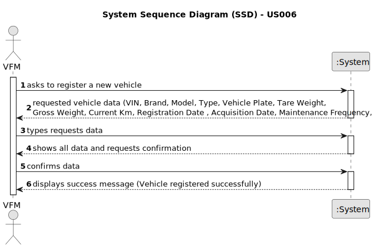

# US006 - Register a Vehicle

## 1. Requirements Engineering

### 1.1. User Story Description

As a Vehicle and Equipment fleet manager (VFM), I wish to register a vehicle including Vin, Brand, Model, Type, Tare Weight, Gross Weight, Current Km, Register Date, Acquisition Date, and Maintenance/Check-up Frequency (in km).

### 1.2. Customer Specifications and Clarifications 

**From the specifications document:**

>  To register a vehicle is required some attributes. The person who register the vehicles is the fleet manager (VFM) and the vehicle is saved by in system. 
>  All the listed vehicle registration attributes are mandatory for successful registration. The system should not allow registration with missing information.
>  Floor Managers can modify existing vehicle registration information.
 
**From the client clarifications:**

> **Question:** To register a vehicle is necessary all attributes ?
> 
> **Answer:** Yes. To register a vehicle in the system, is request every attribute, in other case, the system should reject.

> **Question:** Should the application identify a registered vehicle by a serial number or other attribute?
>
> **Answer:** By plate id

> **Question:** Should the application a group the vehicles by their brand, serial number or other attribute?
>
> **Answer:** No requirements were set concerning groups of vehicles

>  **Question:** If the Fm inserts the same vehicle by mistake, should it inform the user of the mistake and give him the option to add another vehicle?
>
> **Answer:** Duplication of data is not a business rule is technical one, since by definition in a set you cant have duplicates

>  **Question:** When a vehicle is registered, are there specific requirements for accepting the brand? For example, does the system need to check if the brand is on a predetermined list? Does this also apply to the model or any other characteristics?
>
> **Answer:** No. One can consider a list os brands and a list of models previously inserted in the system. No need to go through validations.

### 1.3. Acceptance Criteria

* **AC1:** All attributes must be filled.
* **AC2:** The system must validate the VIN to ensure it is unique and corresponds to a non-registered vehicle.
* **AC3:** Acquisition date must be after the registration date.

### 1.4. Found out Dependencies

* None.

### 1.5 Input and Output Data

**Input Data:**

* Typed data:
    * Vehicle identification number (VIN)
    * Vehicle Plate
    * Brand
    * Model
    * Tare Weight (weight of the empty vehicle)
    * Gross weight (maximum weight of the loaded vehicle)
    * Current Kilometer Reading
    * Registration Date
    * Acquisition Date
    * Checkup Frequency (in Kilometers)
	
* Selected data:
    * Type (car, truck, etc.)

**Output Data:**

* (In)Success of the operation

### 1.6. System Sequence Diagram (SSD)

**_Other alternatives might exist._**

#### Alternative One

### 1.7 Other Relevant Remarks

* Implement appropriate permissions and access controls to restrict the ability to register a vehicle to authorized VFM users only.