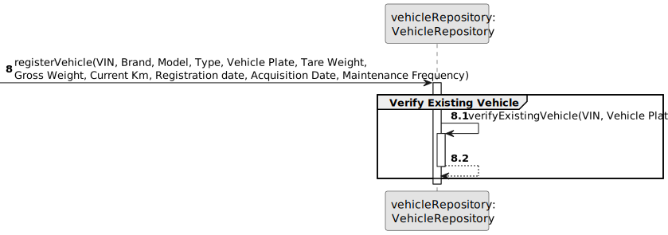
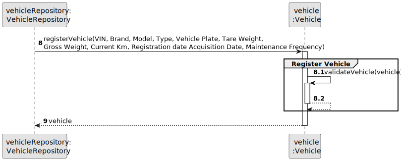

# US006 - Register a Vehicle 

## 3. Design - User Story Realization 

### 3.1. Rationale

_**Note that SSD - Alternative One is adopted.**_

| Interaction ID | Question: Which class is responsible for...     | Answer                    | Justification (with patterns)                                                                                                                                                                 |
|:---------------|:------------------------------------------------|:--------------------------|:----------------------------------------------------------------------------------------------------------------------------------------------------------------------------------------------|
| Step 1         | ... interacting with the actor?                 | RegisterVehicleUI         | Pure Fabrication: There is no need to assign this responsibility to any existing class in the Domain Model. The UI class is a utility class for handling user interaction.                    |
|                | ... display vehicle data input fields?          | RegisterVehicleUI         | Pure Fabrication: RegisterVehicleUI displays the input fields for vehicle data, promoting low coupling by separating UI logic from domain logic.                                              |
|                | ... confirms the user's input data?             | RegisterVehicleUI         | Pure Fabrication: RegisterVehicleUI confirms the user's input data before proceeding with the registration process, ensuring data integrity and adhering to the Creator pattern.              |
| Step 2         | ... coordinating the US?                        | RegisterVehicleController | Controller: RegisterVehicleController is responsible for coordinating and controlling the flow of interaction, applying the Controller pattern.                                               |
|                | ... knowing the user using the system?          | UserSession               | Information Expert: UserSession manages user authentication and authorization, following the Information Expert pattern.                                                                      |
| Step 3         | ... handles the registration of the vehicle?    | RegisterVehicleController | Controller: RegisterVehicleController manages the registration process, ensuring high cohesion and low coupling by encapsulating related functionality.                                       |
|                | ... verify existed vehicle?                     | VehicleRepository         | Information Expert: VehicleRepository performs global validation, adhering to the Protected Variation pattern by encapsulating data access.                                                   |
| Step 4         | ... ensures data integrity during registration? | VehicleRepository         | VehicleRepository ensures that only valid and consistent data is stored in the system, following the High Cohesion pattern.                                                                   |
| Step 5         | ... stores vehicle registration data?           | VehicleRepository         | Information Expert: VehicleRepository is responsible for persisting and managing vehicle registration data, applying the Low Coupling pattern by decoupling data storage from business logic. |
| Step 6         | ... validating all data (local validation)?     | Vehicle                   | Information Expert: Vehicle performs local validation on its attributes, adhering to the Information Expert pattern by encapsulating its own data validation logic.                           | 
|                | ... validating all data (global validation)?    | VehicleRepository         | Information Expert: VehicleRepository performs global validation, following the Protected Variation pattern by encapsulating validation rules.                                                | 
| Step 7         | ... informing operation success?                | RegisterVehicleUI         | Pure Fabrication: RegisterVehicleUI handles user interaction and displays success/error messages, promoting low coupling and high cohesion by encapsulating UI logic.                         | 

### Systematization ##

According to the taken rationale, the conceptual classes promoted to software classes are: 

* Vehicle
* VehicleRepository
* RegisterVehicleController

Other software classes (i.e. Pure Fabrication) identified: 

* RegisterVehicleUI  
* UserSession

## 3.2. Sequence Diagram (SD)

_**Note that SSD - Alternative Two is adopted.**_

### Full Diagram

This diagram shows the full sequence of interactions between the classes involved in the realization of this user story.

### Split Diagrams

The following diagram shows the same sequence of interactions between the classes involved in the realization of this user story, but it is split in partial diagrams to better illustrate the interactions between the classes.

It uses Interaction Occurrence (a.k.a. Interaction Use).

**Get Vehicle Repository Partial SD**

**Verify Existing Vehicle Partial SD**

**Register a Vehicle**

## 3.3. Class Diagram (CD)

