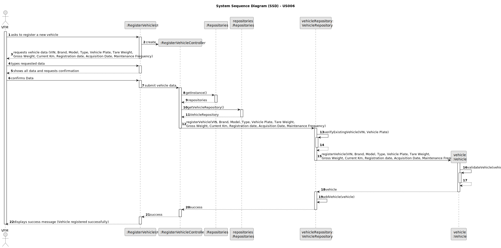

# US006 - Create a Task 

## 3. Design - User Story Realization 

### 3.1. Rationale

_**Note that SSD - Alternative One is adopted.**_

| Interaction ID | Question: Which class is responsible for...      | Answer                    | Justification (with patterns)                                                                                 |
|:---------------|:-------------------------------------------------|:--------------------------|:--------------------------------------------------------------------------------------------------------------|
| Step 1  		     | 	... interacting with the actor?                 | RegisterVehicleUI         | Pure Fabrication: there is no reason to assign this responsibility to any existing class in the Domain Model. |
| 			  		        | 	... coordinating the US?                        | RegisterVehicleController | Controller: responsible for coordinating and controlling the flow of interaction.                             |
| 			  		        | 	... instantiating a new Vehicle?                | Vehicle                   | Creator : in the DM, a Vehicle is created during the registration process.                                    |
| 			  		        | ... knowing the user using the system?           | UserSession               | IE: cf. Authentication & Authorization component documentation.                                               |
| 			  		        | ... knowing the brand of the vehicle							      | BrandRepository           | IE: The BrandRepository retrieves brand information from the data source.                                     |
| Step 2  		     | 	... validating the VIN?						                   | Vehicle                   | IE: The Vehicle object performs local validation on its attributes.                                           |
|                | ... providing the list of available brands?      | BrandRepository           | Creator : The BrandRepository retrieves list of brands.                                                       |
| Step 3  		     | 	...maintaining the vehicle data?                | Vehicle                   | IE: The Vehicle object holds the data for each registered vehicle.                                            |
|                | ... retrieving brand information                 | BrandRepository           | Creator : The BrandRepository retrieves brand information from the data source.                               |
|                | ... selecting a brand                            | RegisterVehicleUI         | IE: The RegisterVehicleUI class presents a list of available brands to the user and handles user selection.   |
| Step 4  		     | 	...ensuring the registration process?           | VehicleRepository         | Creator : The VehicleRepository manages the persistence of vehicle data.                                      |
| 		             | 	... validating the vehicle data?                | Vehicle                   | IE: The Vehicle object performs local validation on its attributes.                                           |
| Step 5  		     | 	... providing ?                                 | Vehicle                   | IE: The Vehicle object performs local validation on its attributes.                                           |
|                |                                                  |                           |
| Step 6  		     | ...coordinating the vehicle registration?							 | RegisterVehicleController | Controller                                                                                                    |              
|                | ... handling persistence of vehicle data ?       | VehicleRepository         | Creator (Rule 1): The VehicleRepository manages the persistence of vehicle data.                              |
| Step 7  		     | 	... validating all data (local validation)?     | Vehicle                   | IE: The Vehicle object performs local validation on its attributes.                                           | 
| 			  		        | 	... validating all data (global validation)?    | VehicleRepository         | Repository (Rule 2): global validation often involves querying data from multiple sources.                    | 
| 			  		        | 	... saving the vehicle register?                | Vehicle                   | IE: The Vehicle object encapsulates its data and handles persistence.                                         | 
| Step 8  		     | 	... informing operation success?                | RegisterVehicleUI         | IE: The RegisterVehicleUI class handles user interaction and displays success/error messages.                 | 

### Systematization ##

According to the taken rationale, the conceptual classes promoted to software classes are: 

* Vehicle

Other software classes (i.e. Pure Fabrication) identified: 

* RegisterVehicleUI  
* RegisterVehicleController

## 3.2. Sequence Diagram (SD)

_**Note that SSD - Alternative Two is adopted.**_

### Full Diagram

This diagram shows the full sequence of interactions between the classes involved in the realization of this user story.

### Split Diagrams

The following diagram shows the same sequence of interactions between the classes involved in the realization of this user story, but it is split in partial diagrams to better illustrate the interactions between the classes.

It uses Interaction Occurrence (a.k.a. Interaction Use).

**Get Task Brand List Partial SD**

**Get Model by Brand Object**

**Register a Vehicle**

## 3.3. Class Diagram (CD)

