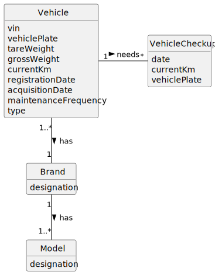

# US007 - Register vehicle checkup

## 2. Analysis

### 2.1. Relevant Domain Model Excerpt 

### 2.2. Other Remarks

- All dates used are the format used are in day/month/year format.
- The measurement used in the checkup is the kilometer.