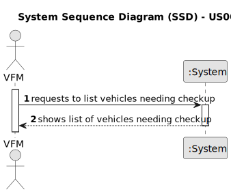

# US008 - List Vehicles Needing Check-up 

## 1. Requirements Engineering

### 1.1. User Story Description

As a Vehicle and Equipment Manager (VFM), I want to list (report) of vehicles needing maintenance.

### 1.2. Customer Specifications and Clarifications 

**From the specifications document:**

>	The system should provide a list of vehicles that need maintenance or check-up based on their maintenance/checkup frequency and current kilometers. 

**From the client clarifications:**

> **Question:** How should the system determine which vehicles need check-up?
>
> **Answer:** The system should compare the current kilometers of each vehicle with their maintenance/checkup frequency to determine if a check-up is due.

>  **Question:** Can the vehicles get placed automatically on a list or the one listing has to be the VFM?
>
> **Answer:** The list of vehicles is automatically created but the creation is triggered by the VFM.

>  **Question:** What information will appear on the final list regarding the vehicle,besides the needing for check-up?
>
> **Answer:** Data that allow to identify the vehicle like Plate, brand and model, as well as, the data that allowed to select/insert te vehicle in the list, number of kms, frequency of checkup and the last checkup.

>  **Question:** What are the requests/ input data to list the vehicles needing the check-up? Type of vehicle, Current Km and Maintenance/Check-up Frequency (in Kms) are sufficient?
>
> **Answer:** Current Km and Maintenance/Check-up Frequency (in Kms) are sufficient, yes.

>  **Question:** Are there acceptance criteria when asking for the list?
>
> **Answer:** The list must contain all vehicles that have already exceeded the number of km required for the inspection or those that are close to it.

>  **Question:**  In this US we should only list the vehicles that need a check-up (surpass the check-up frequency in KM) or that will shortly need a check-up (5% to the check-up frequency), correct? If so, the information about the checkup frequency for each vehicle should be asked in US07?
>
> **Answer:** No. The Maintenance/Check-up Frequency (in km) is registered in US06.

>  **Question:** "The list must clearly identify the vehicles through: plate number, brand, model and the [?] that justified the checkup need."
Did you mean the reason for the check-up need?
>
> **Answer:** DATA. Current kms, frequency, last checkup kms, next checkup (optimal) kms.

> **QUESTION:**  In US 08 how should the vehicles be sorted in the list and does the user have any control over what determines what is used to sort the vehicles? For example, the vehicles licence plate, its gross weight or km driven over the check-up limit.
>
> **Answer:** No specific order is required; each dev team can decide about UX aspects.

> **Question:** Are there any specific criteria for determining which vehicles need check-up?
> 
> **Answer:** Yes; previously answered.

> **Question:** Should the list include all vehicles or only those assigned to a specific location?
>
> **Answer:** All.

### 1.3. Acceptance Criteria

* **AC1:** The system should generate a list of vehicles that are due for a check-up based on their maintenance/checkup frequency and current kilometers.
* **AC2:** The list should include relevant information such as vehicle ID/VIN, brand, model, and current kilometers.
* **AC3:** The list should be easily accessible to the Facilities Manager.
* **AC4:** The report should have the data concerning the vehicle description (Plate, Brand, Model and Current Kms) and the Checkup related data.

### 1.4. Found out Dependencies

* There is a dependency on "US006 - Register a Vehicle" - The ability to list vehicles needing check-up depends on the vehicles being registered in the system with relevant information such as current kilometers and maintenance/checkup frequency.
* There is a dependency on "US007 - Register Vehicle Check-up" - The ability to list vehicles needing check-up depends on the registration of vehicle check-ups. This allows the system to track when the last check-up was performed and determine if a vehicle is due for maintenance based on its maintenance/checkup frequency.

### 1.5 Input and Output Data

**Input Data:**

* None

**Output Data:**

* List of vehicles needing check-up
* Relevant vehicle information (e.g., ID/VIN, brand, model, current kilometers)
* (In)Success of the operation  

### 1.6. System Sequence Diagram (SSD)

**_Other alternatives might exist._**

#### Alternative One

### 1.7 Other Relevant Remarks

* Implement appropriate logic to determine the vehicles needing check-up based on maintenance/checkup frequency and current kilometers.
* Ensure that the generated list is accurate and up-to-date.
* Provide user-friendly interface with intuitive navigation and filtering options for easy access to the list of vehicles needing check-up.
* The system should allow filtering or sorting options for the list based on different criteria, such as vehicle brand or check-up due date.