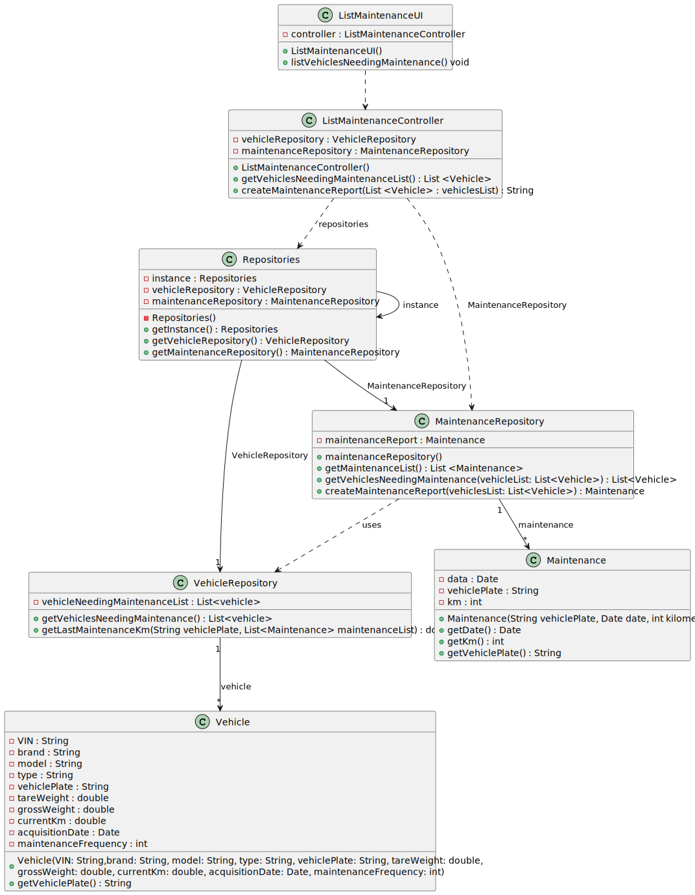

# US008 - List Vehicles Needing Check-up

## 3. Design - User Story Realization 

### 3.1. Rationale

_**Note that SSD - Alternative One is adopted.**_

| Interaction ID | Question: Which class is responsible for...   | Answer                    | Justification (with patterns)                                                                                 |
|:---------------|:----------------------------------------------|:--------------------------|:--------------------------------------------------------------------------------------------------------------|
| Step 1  		     | ... interacting with the actor?               | ListMaintenanceUI         | Pure Fabrication: there is no reason to assign this responsibility to any existing class in the Domain Model. |
| 			  		        | ... instantiating a new MaintenanceReport?    | MaintenanceRepository     | Creator (Rule 1): in the DM MaintenanceReport is directly created.                                            |
| Step 2	  		    | ... coordinating the US?                      | ListMaintenanceController | Controller: responsible for coordinating and controlling the flow of interaction.                             |
| 			  		        | ... knowing the user using the system?        | UserSession               | IE: cf. A&A component documentation.                                                                          |
| Step 3  		     | 	...handles the creation of the report?       | ListMaintenanceController | The controller class manages the creation process.                                                            |
| 		             | ... knowing the vehicles list							          | VehicleRepository         | Repository (Rule2): responsible for storing and retrieving vehicle data.                                      |
| Step 4  		     | 	...knowing the vehicles needing maintenance? | MaintenanceRepository     | IE: Vehicles needing maintenance are determined by a logic algorithm on maintenance repository.               |
| Step 5  		     | 	... creating a maintenance report?						     | MaintenanceRepository     | Creator (Rule 1): in the DM MaintenanceReport is directly created .                                           |
| Step 6  		     | 	... validating all data (local validation)?  | MaintenanceReport         | IE: owns its data.                                                                                            | 
| 			  		        | 	... validating all data (global validation)? | MaintenanceRepository     | Repository (Rule 2): global validation often involves querying data from multiple sources.                    | 
| 			  		        | 	... saving the created maintenance report?   | MaintenanceRepository     | Repository (Rule 2): responsible for storing and retrieving maintenance reports.                              | 
| Step 7  		     | 	... informing operation success?             | ListMaintenanceUI         | IE: is responsible for user interactions.                                                                     | 

### Systematization ##

According to the taken rationale, the conceptual classes promoted to software classes are: 

* MaintenanceReport
* MaintenanceRepository
* VehicleRepository

Other software classes (i.e. Pure Fabrication) identified: 

* ListMaintenanceUI  
* ListMaintenanceController

## 3.2. Sequence Diagram (SD)

_**Note that SSD - Alternative Two is adopted.**_

### Full Diagram

This diagram shows the full sequence of interactions between the classes involved in the realization of this user story.

### Split Diagrams

The following diagram shows the same sequence of interactions between the classes involved in the realization of this user story, but it is split in partial diagrams to better illustrate the interactions between the classes.

It uses Interaction Occurrence (a.k.a. Interaction Use).

**Get Vehicle List Partial SD**

**Get Maintenance Repository Partial SD**

**Create Maintenance Report*

## 3.3. Class Diagram (CD)

