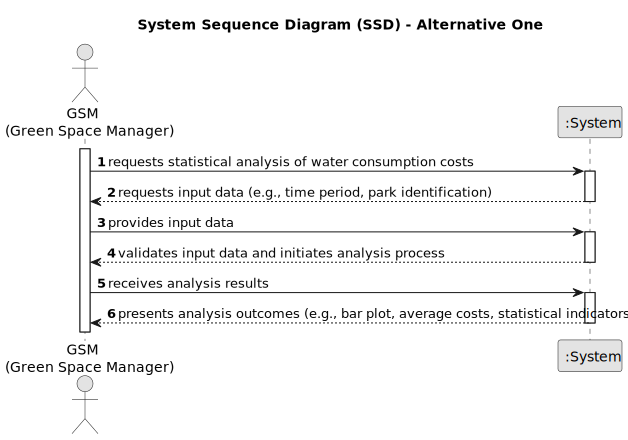

# US009 - Known the exact costs referring to water consumption of specific green spaces

## 1. Requirements Engineering

### 1.1. User Story Description

As a GSM, I want to know the exact costs referring to water consumption of specific green spaces so that I may manage these expenses efficiently. Therefore, within this user story, the aim is to carry out a statistical analysis concerning the water consumption costs in all parks. The "WaterUsed.csv" file provides the necessary data to carry out the study. This file records daily water consumption (in m³) since the day each park opened. The amount paid for water is $0.7 per m³, up to a consumption of 50 m³, with a fee of 15% added for higher consumption levels. The data file contains records of the following information: "Park Identification," "Year," "Month," "Day," "Consumption."

### 1.2. Customer Specifications and Clarifications 

**From the specifications document:**

> Water consumption is measured in m³.
> The cost of water is in USD.
> The "WaterUsed.csv" file contains records of "Park Identification," "Year," "Month," "Day," and "Consumption."

**From the client clarifications:**

> **Question:** Which is the unit of measurement used to estimate duration?
>
> **Answer:** Duration is estimated in days.

> **Question:** Is the 15% rate when consumption exceeds 50 m³ applied to the entire volume of water or only to the volume that was exceeded?
> 
> **Answer:** To the exceeded volume.

> **Question:** Is the consumption limit of 50m³ calculated per day or per month?
> 
> **Answer:** Per month.

> **Question:** How will the average monthly water consumption costs be presented? Is the value saved in a specific file or will it simply be presented to the user?
>
> **Answer:** It will be presented to the user/client.

> **Question:** What information do you want to be displayed in the histograms?
>
> **Answer:** All water consumption recorded for the two selected parks.

> **Question:** When the user enters the park identification, should this be by name or through an ID?
>
> **Answer:** By name.

> **Question:** On creating the barplot, what's the reason behind asking for the time period (StartMonth, EndMonth) since the barplot is a monthly-based graph? Wouldn't it make more sense just to have the name of the desired month instead?
>
> **Answer:** The barplot represents a bar for each month requested. For example, I might only be interested in knowing consumption in the summer months.

> **Question:** When comparing the park with the highest and lowest water consumption, is it possible that the day of the highest value is not the same as the day of the lowest value? (In this case we will be comparing two parks' data from two different days, am I right?)
>
> **Answer:** You will choose two parks. The one that had a day (it doesn't matter what day) with a higher consumption than all those registered (in all the parks) and another park that had a day with a lower consumption than all those registered (in all the parks).

> **Question:** What happens if the days with the highest and lowest consumption are associated with the same park?
>
> **Answer:** Presents the analysis for this park only.

> **Question:** What happens if there are several parks with the same highest water consumption and the same for the smallest? Do we choose two at our discretion? Or do we study all the parks in question?
>
> **Answer:** Carry out the study for all parks, including the histograms.

> **Question:** Should we output all the information to a file or show it on the screen and offer that option to the user?
>
> **Answer:** The output should be shown.
>
> **Question:** Regarding the creation of the Barplot with the monthly water consumption of the selected park, do the start and end months belong to the same year or can the year change?
>
> **Answer:** They belong to the same year.

### 1.3. Acceptance Criteria

* **AC1:** Successfully generate a bar plot showing monthly water consumption for a specified park and time period.
* **AC2:** Calculate the average monthly costs of water consumption for specified parks.
* **AC3:** Conduct statistical analysis for parks with the highest and lowest water consumption, including mean, median, standard deviation, and coefficient of skewness.
* **AC4:** Create relative and absolute frequency tables considering 5 classes.
* **AC5:** Identify outliers in the data and handle them appropriately.
* **AC6:** Visualize data through histograms with 10 classes.

### 1.4. Found out Dependencies

* No dependencies.

### 1.5 Input and Output Data

**Input Data:**

* Data from "WaterUsed.csv":

  * Park Identification
  * Year
  * Month
  * Day
  * Consumption (m³)

* User specifications:

  * Time period (StartMonth, EndMonth)
  * Park identification
  * Number of parks to be analyzed 

**Output Data:**

* Bar plot illustrating monthly water consumption
* Average monthly costs of water consumption
* Statistical indicators for parks with highest and lowest consumption
* Relative and absolute frequency tables
* Identified outliers
* Histograms with 10 classes
* (In)Success of the operation

### 1.6. System Sequence Diagram (SSD)

**_Other alternatives might exist._**

#### Alternative One

### 1.7 Other Relevant Remarks
* none
