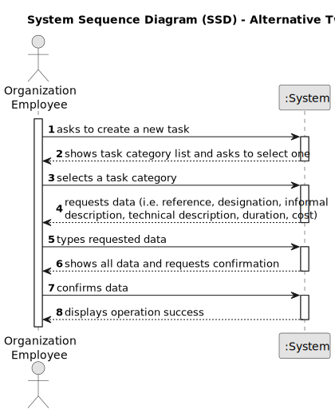

# US002 - Register a Job 

## 1. Requirements Engineering

### 1.1. User Story Description

As a GSM, I want to conduct a statistical analysis of water consumption costs in parks to efficiently manage expenses. The analysis will utilize data from the "WaterUsed.csv" file, which records daily water consumption (in m³) since each park's opening. The cost of water is $0.7 per m³, up to a consumption of 50 m³, with a 15% fee added for higher consumption levels. The analysis aims to:

* Generate a bar plot illustrating monthly water consumption for a specified time period and park.
* Calculate the average monthly costs of water consumption for a specified number of parks and park identification.
* Analyze statistical indicators, including mean, median, standard deviation, and coefficient of skewness, for parks with the highest and lowest water consumption.
* Create relative and absolute frequency tables (classified data) considering 5 classes.
* Identify outliers in the data.
* Visualize data through histograms with 10 classes.

### 1.2. Customer Specifications and Clarifications 

**From the specifications document:**

> Water consumption is measured in m³.
> The cost of water is in USD.
> The "WaterUsed.csv" file contains records of "Park Identification," "Year," "Month," "Day," and "Consumption."

**From the client clarifications:**

> **Question:** Which is the unit of measurement used to estimate duration?
>
> **Answer:** Duration is estimated in days.

### 1.3. Acceptance Criteria

* AC1: Successfully generate a bar plot showing monthly water consumption for a specified park and time period.
* AC2: Calculate the average monthly costs of water consumption for specified parks.
* AC3: Conduct statistical analysis for parks with the highest and lowest water consumption, including mean, median, standard deviation, and coefficient of skewness.
* AC4: Create relative and absolute frequency tables considering 5 classes.
* AC5: Identify outliers in the data and handle them appropriately.
* AC6: Visualize data through histograms with 10 classes.

### 1.4. Found out Dependencies

* No dependencies.

### 1.5 Input and Output Data

**Input Data:**

* Data from "WaterUsed.csv":

  * Park Identification
  * Year
  * Month
  * Day
  * Consumption (m³)

* User specifications:

  * Time period (StartMonth, EndMonth)
  * Park identification
  * Number of parks to be analyzed 

**Output Data:**

* Bar plot illustrating monthly water consumption
* Average monthly costs of water consumption
* Statistical indicators for parks with highest and lowest consumption
* Relative and absolute frequency tables
* Identified outliers
* Histograms with 10 classes
* (In)Success of the operation

### 1.6. System Sequence Diagram (SSD)

**_Other alternatives might exist._**

#### Alternative One

#### Alternative Two

### 1.7 Other Relevant Remarks

* The created task stays in a "not published" state in order to distinguish from "published" tasks.