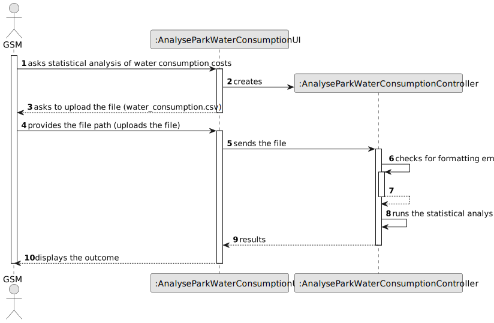

# US009 - Known the exact costs referring to water consumption of specific green spaces

## 3. Design - User Story Realization 

### 3.1. Rationale

_**Note that SSD - Alternative One is adopted.**_

| Interaction ID | Question: Which class is responsible for...          | Answer                                 | Justification (with patterns)                                                             |
|----------------|:-----------------------------------------------------|:---------------------------------------|-------------------------------------------------------------------------------------------|
|                | ... interacting with the actor?                      | AnalyseParkWaterConsumptionUI          | Pure Fabrication: there is no reason to assign this responsibility to any existing class. |
|                | ... coordinating the US?                             | AnalyseParkWaterConsumptionController  | Controller (Model View Controller)                                                        |
|                | ... validating file format?                          | AnalyseParkWaterConsumptionController  | Information Expert                                                                        |
|                | ... performing statistical analysis?                 | AnalyseParkWaterConsumptionController  | Controller: Responsible for executing the statistical analysis logic.                     |
|                | ... providing statistical results?                   | AnalyseParkWaterConsumptionController  | Controller                                                                                |
|                | ... displaying results to the user?                  | AnalyseParkWaterConsumptionUI          | Pure Fabrication: UI component for displaying results to the user.                        |

### Systematization ##

According to the taken rationale, the conceptual classes promoted to software classes are: 

* AnalyseParkWaterConsumptionController
* AnalyseParkWaterConsumptionUI

Other software classes (i.e. Pure Fabrication) identified: 

* None identified

## 3.2. Sequence Diagram (SD)

_**Note that SSD - Alternative Two is adopted.**_

### Full Diagram

This diagram shows the full sequence of interactions between the classes involved in the realization of this user story.

### Split Diagrams

The following diagram shows the same sequence of interactions between the classes involved in the realization of this user story, but it is split in partial diagrams to better illustrate the interactions between the classes.

It uses Interaction Occurrence (a.k.a. Interaction Use).

## 3.3. Class Diagram (CD)

