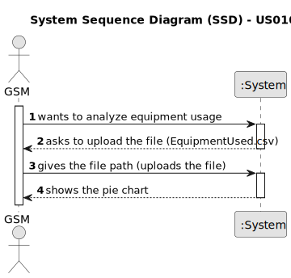

# US010 - Known in a pie chart which piece(s) of equipment is/are used in each day

## 1. Requirements Engineering

### 1.1. User Story Description

As a GSM, I want to know which piece(s) of equipment is/are
used in each day so that I can understand the users’ preferences.

### 1.2. Customer Specifications and Clarifications 

**From the specifications document:**

>	Consider that the park has the following equipment: walking paths, children’s playground, picnic area, and exercise machines (gymnastics equipment). At the park exit there is an electronic device with a list of all
the equipment, in which the user(s) must indicate the equipment they
used that day.

>	In the file ”EquipmentUsed.csv” the choices of 1000 users are recorded.
Make a pie chart representing, in percentage, the use of each piece of
equipment.

**From the client clarifications:**

> **Question:** In the US10 the client says they have an electronic device that allows the users to insert the equipment they used. How is that csv file sent to our product? Is it trough an API or is the GSM responsible for uploading the document before generating the list of equipment used in that day?
>
> **Answer:** ATM you can assume that someone will upload the file (maybe the GSM).

> **Question:** On the "EquipmentUsed.csv", are there only recorded the choices of 1000 users? Could the GSM request a different number, for example, the choices of 800 users? Is it a random selection, or is it the last responses?
>
> **Answer:** Since the data doesn't contain any data concerning the users, the file simply contains 1000 answers/choices.

### 1.3. Acceptance Criteria

* **AC1:** All required fields must be filled in.
* **AC2:** The task reference must have at least 5 alphanumeric characters.
* **AC3:** When creating a task with an existing reference, the system must reject such operation and the user must be able to modify the typed reference.

### 1.4. Found out Dependencies

* The file ”EquipmentUsed.csv".

### 1.5 Input and Output Data

**Input Data:**

* Typed data:
    * none
	
* Selected data:
    * equipment used 

**Output Data:**

* Pie chart representing, in percentage, the use of each piece of
  equipment
* (In)Success of the operation

### 1.6. System Sequence Diagram (SSD)

**_Other alternatives might exist._**

#### Alternative One

### 1.7 Other Relevant Remarks

* The created task stays in a "not published" state in order to distinguish from "published" tasks.