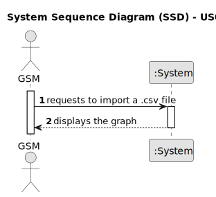

# US012 - I want to import a .csv file containing routes

## 1. Requirements Engineering

### 1.1. User Story Description

As a Green Spaces Manager (GSM), I want to import a .csv file containing lines
### 1.2. Customer Specifications and Clarifications 

**From the specifications document:**

>   The .csv file containing lines with Water Point X, Water Point Y, and Distance should follow a specific format.

**From the client clarifications:**

> **Question:** Hello customer, if the selected file contains two or more lines with the same x and y points but different distances, we need to decide how to handle this situation. Would you prefer an error message to appear, informing the GSM that there is ambiguous information, or should we overwrite the previous information regarding these points?
>
> **Answer:** The data contained in the .csv file is previously validated; despite that a message would be preferable.

> **Question:** Good afternoon. I would like to confirm if, in the csv file, "waterPointX" and "waterPointY" are always whole numbers or can they be letters? Thanks.
>
> **Answer:** They can be letters or words (strings). They are any name that identifies the irrigation point.

> **Question:** Hello customer. Will we be given the distance and/or costs between the different water points? In US12 when we only receive the distance will this value be used as a cost in the minimum accumulated cost algorithm developed in US13? Thank you very much.
>
> **Answer:** Perhaps you already clarified your doubt, but here you have: you only have one value assigned between different water points, called the "cost", that could mean a distance or something else.

### 1.3. Acceptance Criteria

* **AC1:** The .csv file must contain columns for Water Point X, Water Point Y, and Distance.
* **AC2:** The system must validate all data contained in the .csv file and provide informative messages to the user in case of issues during the import process.

### 1.4. Found out Dependencies

* None

### 1.5 Input and Output Data

**Input Data:**

* Imported data:
    * a .csv file

**Output Data:**

+ confirmation message

### 1.6. System Sequence Diagram (SSD)

**_Other alternatives might exist._**

#### Alternative One

### 1.7 Other Relevant Remarks

* The imported data should be validated to ensure that it meets the required format and structure before being processed by the system
* Error handling mechanisms should be implemented to handle cases where the .csv file is contains invalid data.