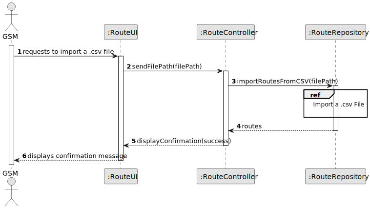
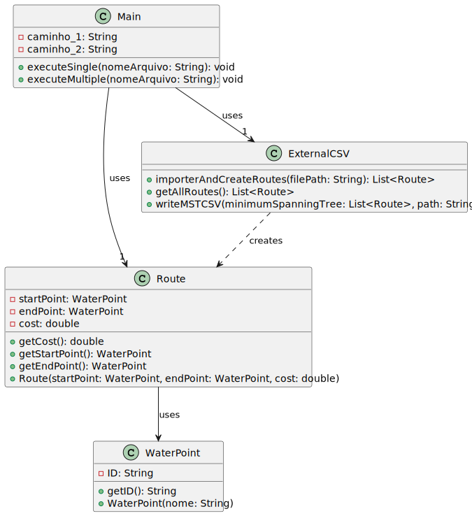

# US012 - I want to import a .csv file containing routes

## 3. Design - User Story Realization 

### 3.1. Rationale

_**Note that SSD - Alternative One is adopted.**_

| Interaction ID | Question: Which class is responsible for...   | Answer          | Justification (with patterns)                                                                                 |
|:---------------|:----------------------------------------------|:----------------|:--------------------------------------------------------------------------------------------------------------|
| Step 1  		     | 	... interacting with the actor?              | RouteUI         | Pure Fabrication: there is no reason to assign this responsibility to any existing class in the Domain Model. |
| 			  		        | 	... coordinating the US?                     | RouteController | Controller: responsible for coordinating and controlling the flow of interaction.                             |
| 			  		        | 	... instantiating a new Route?               | RouteRepository | Creator (Rule 1): the Repository creates instances of routes based on the imported data.                      |
| 			  		        | ... knowing the user using the system?        | UserSession     | IE: cf. A&A component documentation.                                                                          |
| 			  		        | 							                                       | RouteRepository | IE: knows/has its own Routes                                                                                  |
| 		    		       | 							                                       | Route           | IE: knows its own data (WaterPoint, Distance)                                                                 |
| 		             | 	... processing the imported CSV file?					   | RouteRepository | The Repository class processes the imported CSV file to extract route data.                                   |
| 		             | 	...saving the inputted data?                 | RouteRepository | IE: The repository persists the routes data.                                                                  |
| 		             | 	...knowing the task categories to show?      | System          | IE: Task Categories are defined by the Administrators.                                                        |
| 		             | 	... saving the selected category?            | RouteRepository | IE: The repository associates the selected category with the imported routes.                                 |
| 		             | 							                                       |                 |                                                                                                               |              
| 		             | 	... validating all data (local validation)?  | Routes          | IE: owns its data.                                                                                            | 
| 			  		        | 	... validating all data (global validation)? | RouteRepository | IE: The repository ensures the overall consistency and integrity of the imported routes data                  | 
| 			  		        | 	... saving the imported route?               | RouteRepository | IE: The repository persists the imported routes data                                                          | 
| Step 2  		     | 	... informing operation success?             | RouteUI         | IE: is responsible for user interactions.                                                                     | 

### Systematization ##

According to the taken rationale, the conceptual classes promoted to software classes are: 

* Route 

Other software classes (i.e. Pure Fabrication) identified: 

* RouteUI  
* RoteController
* RouteRepository

## 3.2. Sequence Diagram (SD)

_**Note that SSD - Alternative Two is adopted.**_

### Full Diagram

This diagram shows the full sequence of interactions between the classes involved in the realization of this user story.

### Split Diagrams

The following diagram shows the same sequence of interactions between the classes involved in the realization of this user story, but it is split in partial diagrams to better illustrate the interactions between the classes.

It uses Interaction Occurrence (a.k.a. Interaction Use).

**Import .csv File Partial SD**

**Get Task Category List Partial SD**

**Get Task Category Object**

**Get Employee**

**Create Task**

## 3.3. Class Diagram (CD)

