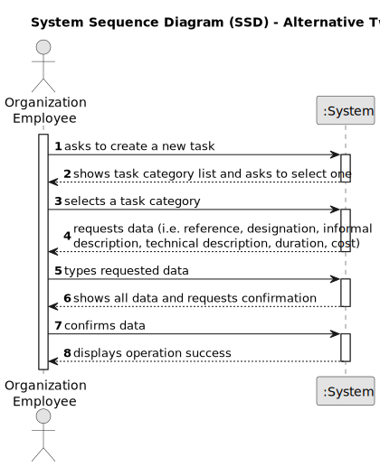

# US013 - Apply an algorithm that returns the routes to be opened, with minimum cost

## 1. Requirements Engineering

### 1.1. User Story Description

As a GSM, I want to apply an algorithm that returns the routes
to be opened and pipes needed to be laid with a minimum accumulated
cost, ensuring that all points are adequately supplied.

### 1.2. Customer Specifications and Clarifications 

**From the specifications document:**

>	

>	

**From the client clarifications:**

> **Question:** 
>
> **Answer:** 

> **Question:** 
>
> **Answer:** 
> 
### 1.3. Acceptance Criteria

* **AC1:** All implemented procedures must only use primitive operations, and not existing functions in JAVA libraries.

### 1.4. Found out Dependencies

* There is a dependency on "US12 - As a GSM, I want to import a .csv file containing lines" as there file must be imported.

### 1.5 Input and Output Data

**Input Data:**

* Typed data:
    * none
	
* Selected data:
    * none

**Output Data:**

* (In)Success of the operation

### 1.6. System Sequence Diagram (SSD)

**_Other alternatives might exist._**

#### Alternative One

#### Alternative Two

### 1.7 Other Relevant Remarks

* The created task stays in a "not published" state in order to distinguish from "published" tasks.