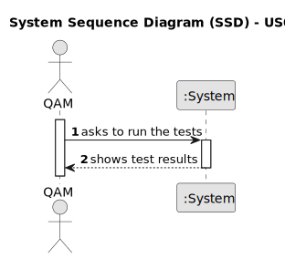

# US014 - Run tests 

## 1. Requirements Engineering

### 1.1. User Story Description

As a Software Quality Assessment Team Manager, I want to run tests for inputs of variable size, to
observe the asymptotic behavior of the execution time of the US013
algorithm

### 1.2. Customer Specifications and Clarifications 

**From the specifications document:**

>	Each task is characterized by having a unique reference per organization, a designation, an informal and a technical description, an estimated duration and cost, as well as a task category. 

>	As long as it is not published, access to the task is exclusive to the employees of the respective organization. 

**From the client clarifications:**

> **Question:** 
>
> **Answer:** 

> **Question:** 
>
> **Answer:** 

### 1.3. Acceptance Criteria

* **AC1:** All required fields must be filled in.
* **AC2:** The task reference must have at least 5 alphanumeric characters.
* **AC3:** When creating a task with an existing reference, the system must reject such operation and the user must be able to modify the typed reference.

### 1.4. Found out Dependencies

* There is a dependency on "US013 - ALTERAÇÃO FUTURA" as there must be at least one algorithm applied to run the tests.

### 1.5 Input and Output Data

**Input Data:**

* Typed data:
    * ALTERAÇÃO FUTURA
	
* Selected data:
    * ALTERAÇÃO FUTURA

**Output Data:**

* Test results
* (In)Success of the operation

### 1.6. System Sequence Diagram (SSD)

**_Other alternatives might exist._**

### 1.7 Other Relevant Remarks

* The created task stays in a "not published" state in order to distinguish from "published" tasks.