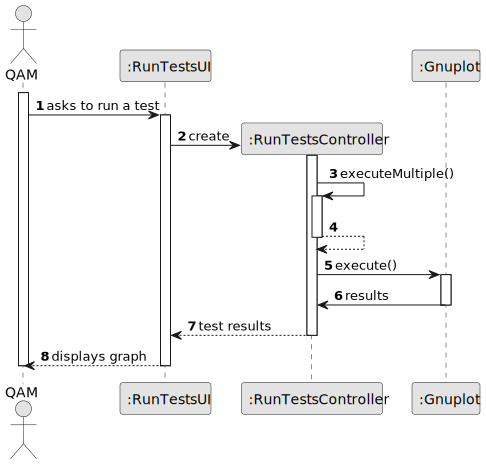
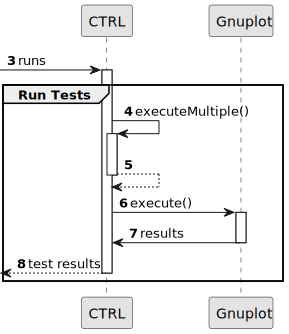
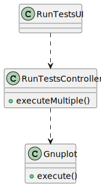

# US014 - Run tests for inputs of variable size, to observe the asymptotic behavior of the execution time of the US13

## 3. Design - User Story Realization 

### 3.1. Rationale

_**Note that SSD - Alternative One is adopted.**_

| Interaction ID | Question: Which class is responsible for... | Answer             | Justification (with patterns)                                                             |
|:---------------|:--------------------------------------------|:-------------------|:------------------------------------------------------------------------------------------|
| Step 1  		     | 	... interacting with the actor?            | RunTestsUI         | Pure Fabrication: there is no reason to assign this responsibility to any existing class. |
| 			  		        | 	... coordinating the US?                   | RunTestsController | Controller.                                                                               |
| 			 Step 2 		  | 	...receiving the image?                    | RunTestsUI         | Pure Fabrication.                                                                         |

### Systematization ##

According to the taken rationale, the conceptual classes promoted to software classes are: 

* none

Other software classes (i.e. Pure Fabrication) identified: 

* RunTestsUI 
* RunTestsController

## 3.2. Sequence Diagram (SD)

_**Note that SSD - Alternative Two is adopted.**_

### Full Diagram

This diagram shows the full sequence of interactions between the classes involved in the realization of this user story.

**Run the tests**

## 3.3. Class Diagram (CD)

