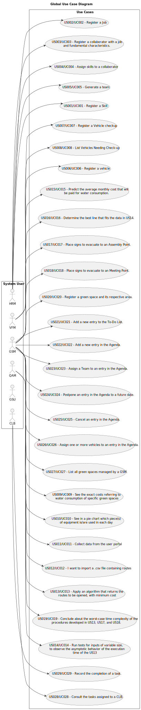

# Use Case Diagram (UCD)

**In the scope of this project, there is a direct relationship of _1 to 1_ between Use Cases (UC) and User Stories (US).
**

This will be the only document where we use “US/UC”, the rest will be prefixed with "US".

This is the global Use Case Diagram and shows the main functions of the main roles in the application:

**For each Use Case/User Story (UC/US), evidence is provided below of the application of the main activities of the
software development process (requirements, analysis, design, testing and code).**

# Use Cases / User Stories

| UC/US       | Description                                                                                                                                  |                   
|:------------|:---------------------------------------------------------------------------------------------------------------------------------------------|
| US001/UC001 | [Register a Skill](../../us001/Readme.md)                                                                                                    |
| US002/UC002 | [Register a Job](../../us002/Readme.md)                                                                                                      |
| US003/UC003 | [Register a collaborator with a job and fundamental characteristics.](../../us003/Readme.md)                                                 |
| US004/UC004 | [Assign Skills to a collaborator](../../us004/Readme.md)                                                                                     |
| US005/UC005 | [Generate a team](../../us005/Readme.md)                                                                                                     |
| US006/UC006 | [Register a Vehicle](../../us006/Readme.md)                                                                                                  |
| US007/UC007 | [Register a vehicle´s checkup](../../us007/Readme.md)                                                                                        |
| US008/UC008 | [List vehicles needing checkup](../../us008/Readme.md)                                                                                       |
| US009/UC009 | [Known the exact costs referring to water consumption of specific green space](../../us009/Readme.md)                                        |
| US010/UC010 | [Known which piece(s) of equipment is/are used in each day](../../us010/Readme.md)                                                           |
| US011/UC011 | [Collect data from the user portal about the use of the park](../../us011/Readme.md)                                                         |
| US012/UC012 | [Import a .csv file containing routes](../../us012/Readme.md)                                                                                |
| US013/UC013 | [Apply an algorithm that returns the routes to be opened and pipes needed to be laid with a minimum accumulated cost](../../us013/Readme.md) |
| US014/UC014 | [Run tests for inputs of variable size](../../us014/Readme.md)                                                                               |
| US015/UC015 | [Predict the average monthly cost that will be paid for water consumption.](../../us015/Readme.md)                                           |
| US016/UC016 | [Determine the best line that fits the data in US14.](../../us016/Readme.md)                                                                 |
| US017/UC017 | [I want to place signs to evacuate to an Assembly Point.](../../us017/Readme.md)                                                             |
| US018/UC018 | [I want to place signs to evacuate to an Meeting Point.](../../us018/Readme.md)                                                              |
| US019/UC019 | [Conclude about the worst-case time complexity of the procedures developed in US13, US17, and US18.](../../us019/Readme.md)                  |
| US020/UC020 | [I want to register a green space and its respective area.](../../us020/Readme.md)                                                           |
| US021/UC021 | [I want to add a new entry to the To-Do List.](../../us021/Readme.md)                                                                        |
| US022/UC022 | [I want to add a new entry in the Agenda.](../../us022/Readme.md)                                                                            |
| US023/UC023 | [I want to assign a Team to an entry in the Agenda.](../../us023/Readme.md)                                                                  |
| US024/UC024 | [I want to Postpone an entry in the Agenda to a future date.](../../us024/Readme.md)                                                         |
| US025/UC025 | [I want to Cancel an entry in the Agenda.](../../us025/Readme.md)                                                                            |
| US026/UC026 | [I want to assign one or more vehicles to an entry in the Agenda.](../../us026/Readme.md)                                                    |
| US027/UC027 | [I need to list all green spaces managed by me.](../../us027/Readme.md)                                                                      |
| US028/UC028 | [I wish to consult the tasks assigned to me.](../../us028/Readme.md)                                                                         |
| US029/UC029 | [I want to record the completion of a task.](../../us029/Readme.md)                                                                          |
