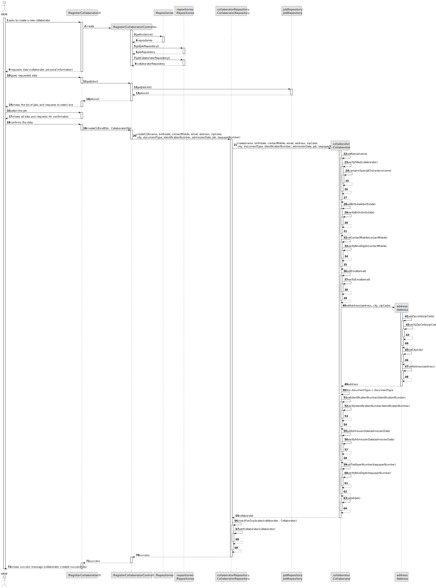

# US003 - Register a collaborator with a job and fundamental characteristics

## 3. Design - User Story Realization 

### 3.1. Rationale

_**Note that SSD - Alternative One is adopted.**_

| Interaction ID | Question: Which class is responsible for...     | Answer                         | Justification (with patterns)                                                           |
|:---------------|:------------------------------------------------|:-------------------------------|:----------------------------------------------------------------------------------------|
| Step 1         | 	... interacting with the actor?                | RegisterCollaboratorUI         | Pure Fabrication: there is no need to assign this responsibility to any existing class. |
|                | 	... coordinating the US?                       | RegisterCollaboratorController | Controller.                                                                             |
| Step 2         | ... requesting data?                            | RegisterCollaboratorUI         | Pure Fabrication.                                                                       |
| Step 3         | ... receiving the data?                         | RegisterCollaboratorUI         | Pure Fabrication.                                                                       |
|                | ... get the job repository?                     | Repositories                   | Information Expert, High cohesion, Low coupling.                                        |
|                | ... get all the jobs and return them as a list? | JobRepository                  | Information Expert.                                                                     |
| Step 4         | 	... showing the jobs to select?                | RegisterCollaboratorUI         | Pure Fabrication.                                                                       |
| Step 5         | ... handling the user selecting a job?          | RegisterCollaboratorUI         | Pure Fabrication.                                                                       |
| Step 6         | ... show the confirmation info?                 | RegisterCollaboratorUI         | Pure Fabrication.                                                                       |
| Step 7         | 	... instantiating a new Collaborator?          | CollaboratorRepository         | Creator, High cohesion, Low coupling.                                                   |
|                | 	... validating all data (local validation)?    | Collaborator                   | Information Expert.                                                                     | 
|                | 	... validating all data (global validation)?   | CollaboratorRepository         | Information Expert.                                                                     | 
|                | 	... saving the Collaborator?                   | CollaboratorRepository         | Information Expert.                                                                     | 
|                | ... having all the repositories?                | Repositories                   | Information Expert, High cohesion, Low coupling.                                        |
| Step 8         | 	... informing operation success?               | RegisterCollaboratorUI         | Pure Fabrication.                                                                       |

### Systematization ##

According to the taken rationale, the conceptual classes promoted to software classes are: 

* Job
* Collaborator
* Address

Other software classes (i.e. Pure Fabrication) identified: 

* RegisterCollaboratorUI  
* RegisterCollaboratorController
* JobRepository
* CollaboratorRepository
* Repositories

## 3.2. Sequence Diagram (SD)

_**Note that SSD - Alternative Two is adopted.**_

### Full Diagram

This diagram shows the full sequence of interactions between the classes involved in the realization of this user story.

## 3.3. Class Diagram (CD)

