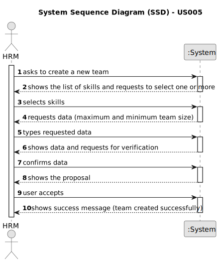

# US005 - Generate a team

## 1. Requirements Engineering
  
### 1.1. User Story Description

As a Human Resources Manager (HRM), I want to generate a team proposal automatically.

### 1.2. Customer Specifications and Clarifications 

**From the specifications document:**

>	At the touch of a button, HRM wants to create a team proposal that meets his needs. To do this, it will ask for the skills that this team must have, and the number minimum and maximum of collaborators.

**From the client clarifications:**

> **Question:** Should the user (HRM) be warned if skills are missing?
>
> **Answer:** The programme makes suggestions for teams and the manager can modify or reject them. The programme should warn of the lack of skills in its changes (or in the modification it simply doesn't show the employees who don't have the skills of the person being changed).

> **Question:** How does it generate the team if there are not enough employees?
>
> **Answer:** The system should provide information why it can't generate a team.

> **Question:** How does he propose a team, for what purpose? (Is there any predefinition )?
> 
> **Answer:** There is no purpose, at least in this sprint.

> **Question:** What are the input data to automatically generate a team?
> 
> **Answer:** the max size of the team (for instance 4) and the skill needed: 4 tree pruner and 1 light vehicle driver meaning that one team member have 2 skills.

> **Question:** What information will the customer provide?
>
> **Answer:** The customer provide the max size of the team and a set of skills.

> **Question:** What should the output of the automation be? (should it just store the team proposal or show it to the customer?)  Will the team proposal be a document about all the instructions of each team member/worker?
>
> **Answer:** The systems provide team proposals and HRM can accept of refuse the proposals. In the future (not in this sprint) HRM may decide to edit the team.

> **Question:** Are the skills(input) typed or selected. Does the output show the team members with or without their skills?
>
> **Answer:** The ux/ui is up to the dev team.

> **Question:** I would to know which business rules apply for the input data to generate a team proposal.
> 
> **Answer:** Max and min team size, and a list of skills needed. For instance: min: 3, max: 4

> **Question:** I would like to ask if, in this US, there should be any more information in the team generated beyond the collaborators in which it consists?
>
> **Answer:** The information should contain each of team members and the skills.

> **Question:** Does the HRM need to specify the task first for the team to be generated?
>
> **Answer:** No

> **Question:** I would also like to know if a collaborator can be in more than one team at the same time?
>
> **Answer:** No

> **Question:** Should there be a default task? If so what are the minimum characteristics(collaborators and jobs needed, time interval, green space...)?
>
> **Answer:** No

> **Question:** Should the generated team be assigned the task defined/default into the to-do list?
>
> **Answer:** No

### 1.3. Acceptance Criteria

* **AC1:** There must be at least one skill selected.
* **AC2:** The maximum and minimum team size and the set of skills need to be supplied by the HRM.

### 1.4. Found out Dependencies

* There is a dependency on "US001 - Register a skill"
* There is a dependency on "US003 - Register a collaborator"
* There is a dependency on "US004 - Assign a skill to a collaborator" since a number of employees and certain skills are required.

### 1.5 Input and Output Data

**Input Data:**

* Typed data:
    * Number minimum of collaborators
    * Number maximum of collaborators

* Selected data:
    * The skills needed
    

**Output Data:**

* List of collaborators
* (In)Success of the operation

### 1.6. System Sequence Diagram (SSD)

**_Other alternatives might exist._**

#### Alternative One

### 1.7 Other Relevant Remarks

* Once the generated list of employees has been displayed, HRM may want to change someone. After this change, the programme must check that the competences selected initially are present in the team change.
* The generated team is stored until it is dismantled by the Human Resources Manager.
* Implement appropriate permissions and access controls to restrict the ability to generate a team to authorized HRM users only.