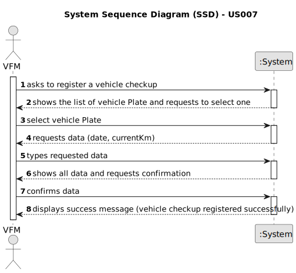

# US007 - Register vehicle checkup

## 1. Requirements Engineering

### 1.1. User Story Description

As a Vehicle and Equipment fleet manager (VFM), I wish to register a vehicle's checkup.

### 1.2. Customer Specifications and Clarifications 

**From the specifications document:**

>	Each vehicle should have a first checkup date and a frequency associated in Km. 

**From the client clarifications:**

> **Question:** What is the unit of measurement used to estimate the checkup frequency (Kms, months, etc.)?
>
> **Answer:** In real context all could be considered, in the scope of this project just Kms will be considered.

> **Question:** What information is needed when registering a vehicle for check up?
>
> **Answer:** Vehicle ID, Date and Kms at checkup.

> **Question:** After register a job/vehicle's checkup should a message (success or failure) or a resume of the register appear?
>
> **Answer:** The UX/UI is up to the dev teams.

> **Question:** Does a vehicle need to be registered in US06 before being able to go for a checkup in US007?
> 
> **Answer:** Yes.

> **Question:** Can a vehicle not have a checkup?
>
> **Answer:** Yes.

> **Question:** What's the supposed vehicle check up supposed to look like?
>
> **Answer:** while registering a checkup, the vehicle id, date and current kms, should be considered.

> **Question:** What information is needed when registering a vehicle for check up?
> 
> **Answer:** Vehicle ID, Date, current kms

> **Question:** Which attributes will you need for the vehicle's check-up?
> 
> **Answer:** Plate number, date, kms at checkup

> **Question:** When the user is registering a vehicle's check-up, it's supposed to insert vehicle ID, Date and Current Kms. My question is: Is this vehicle ID the license plate? Because in ther US006 it's supposed to register the license plate of the vehicle and not an vehicle ID. If these concepts are not the same where in the process the user register the vehicle ID?
>
> **Answer:** The business vehicle ID is the licence plate.

### 1.3. Acceptance Criteria

* **AC1:** All required fields must be filled in.
* **AC2:** Every vehicle should have a checkup frequency associated.
* **AC3:** A vehicle should not have a checkup registered before its acquisition date. 
* **AC4:** The current kilometers must not be less than the old ones recorded (if it's a first checkup, the kilometers must not be less than 0).

### 1.4. Found out Dependencies

* There is a dependency on "US006 - Register a vehicle" as there must be a vehicle existent to associate a checkup.

### 1.5 Input and Output Data

**Input Data:**

* Selected data:
    * Vehicle Plate

* Typed data:
    * Date of the checkup
    * Current Km

**Output Data:**

* (In)Success of the operation

### 1.6. System Sequence Diagram (SSD)

**_Other alternatives might exist._**

#### Alternative One

### 1.7 Other Relevant Remarks

* Implement appropriate permissions and access controls to restrict the ability to register vehicle checkup to authorized VFM users only.