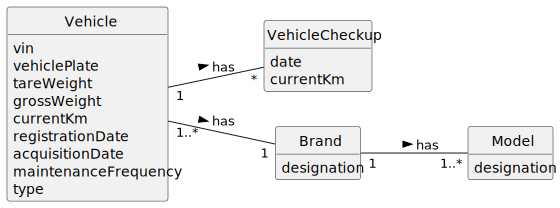

# US008 - List Vehicles Needing Check-up

## 2. Analysis

### 2.1. Relevant Domain Model Excerpt 

### 2.2. Other Remarks

- All dates used (acquisition date and date of checkup) are in day/month/year format.
- The measure of recorded weight is the kilogram.
- Vin should be filled in with 17 letters and numbers.
- The licence plate will have 6 alphanumeric digits (European style).