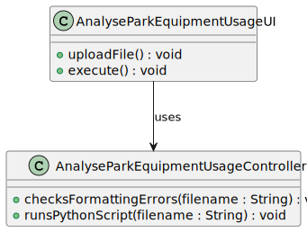

# US010 - Known in a pie chart which piece(s) of equipment is/are used in each day

## 3. Design - User Story Realization 

### 3.1. Rationale

_**Note that SSD - Alternative One is adopted.**_

| Interaction ID | Question: Which class is responsible for... | Answer                              | Justification (with patterns)                                                           |
|:---------------|:--------------------------------------------|:------------------------------------|:----------------------------------------------------------------------------------------|
| 		   Step 1    | 	... interacting with the actor?            | AnalyseParkEquipmentUsageUI         | Pure Fabrication: there is no need to assign this responsibility to any existing class. |
| 			  		        | 	... coordinating the US?                   | AnalyseParkEquipmentUsageController | Controller.                                                                             |
| Step 2         | ... asking the filepath?                    | AnalyseParkEquipmentUsageUI         | Pure Fabrication.                                                                       |
| Step 3         | ... executing the python file?              | AnalyseParkEquipmentUsageController | Controller.                                                                             |
| 		Step 4       | 	... informing operation success?           | AnalyseParkEquipmentUsageUI         | Pure Fabrication.                                                                       | 

### Systematization ##

According to the taken rationale, the conceptual classes promoted to software classes are: 

* none

Other software classes (i.e. Pure Fabrication) identified: 

* AnalyseParkEquipmentUsageUI
* AnalyseParkEquipmentUsageController

## 3.2. Sequence Diagram (SD)

_**Note that SSD - Alternative Two is adopted.**_

### Full Diagram

This diagram shows the full sequence of interactions between the classes involved in the realization of this user story.

### Split Diagrams

The following diagram shows the same sequence of interactions between the classes involved in the realization of this user story, but it is split in partial diagrams to better illustrate the interactions between the classes.

It uses Interaction Occurrence (a.k.a. Interaction Use).

## 3.3. Class Diagram (CD)

