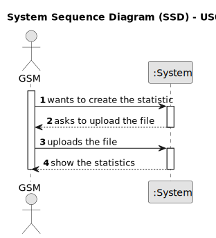

# US011 - Collect data from the user portal

## 1. Requirements Engineering

### 1.1. User Story Description

As a GSM, I want to be able to collect data from the user portal about the use of the park, so that I may understand the use of the park by different age groups.
### 1.2. Customer Specifications and Clarifications 

**From the specifications document:**

> To analyse the use of the park by age groups, a three-question survey was inserted in the user portal:
> Age range (1 - Child (up to 15 years old); 2 - Adult (between 16 and 65 years old; 3 - Senior (over 65 years old))
> // Would you recommend the park to others? (Y/N)
> // How many times do you visit the park per month? (Numeric)

**From the client clarifications:**

> **Question:** 
>
> **Answer:** 

### 1.3. Acceptance Criteria

* **AC1:** Indicate the type of each of the three variables.
* **AC2:** Indicate the proportion of users from each age group who would recommend the park to others.
* **AC3:** Create a boxplot for each age group, regarding the monthly frequency of use of the park, and draw the main conclusions obtained from this type of graph.

### 1.4. Found out Dependencies

* The file ”Inquiry.csv".

### 1.5 Input and Output Data

**Input Data:**

* Typed data:
    * none
	
* Selected data:
    * File

**Output Data:**

* A boxplot image.
* Data related to the proportion of users from each age group.

### 1.6. System Sequence Diagram (SSD)

**_Other alternatives might exist._**

#### Alternative One

### 1.7 Other Relevant Remarks

* none