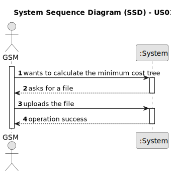

# US013 - Apply an algorithm that returns the routes to be opened, with minimum cost

## 1. Requirements Engineering

### 1.1. User Story Description

As a GSM, I want to apply an algorithm that returns the routes
to be opened and pipes needed to be laid with a minimum accumulated
cost, ensuring that all points are adequately supplied.

### 1.2. Customer Specifications and Clarifications 

**From the specifications document:**

>	

>	

**From the client clarifications:**

> **Question:** 
>
> **Answer:** 

> **Question:** 
>
> **Answer:** 
> 
### 1.3. Acceptance Criteria

* **AC1:** All implemented procedures must only use primitive operations, and not existing functions in JAVA libraries.
* **AC2:** All implemented procedures must only use primitive operations, and not existing functions in JAVA libraries.
* **AC3:** The procedure should return a .csv file with the output subgraph, format (vertice, vertice, edge cost), and the respective total cost. It should also present the visualization of the drawing (using, for example, Graphviz or GraphStream packages) of a given input graph, and the output subgraph.
* **AC4:** Work delivery format: a folder with (i) the drawing of the input and output graphs, respectively, for the two garden examples, (ii) the .csv file with the output graph and the respective total cost, and (iii) a .pdf print with only the procedure(s) implemented for solve this problem.
### 1.4. Found out Dependencies

* There is a dependency on "US12 - As a GSM, I want to import a .csv file containing lines" as there file must be imported.

### 1.5 Input and Output Data

**Input Data:**

* Typed data:
    * none
	
* Selected data:
    * none

**Output Data:**

* (In)Success of the operation

### 1.6. System Sequence Diagram (SSD)

**_Other alternatives might exist._**

#### Alternative One

### 1.7 Other Relevant Remarks

* none