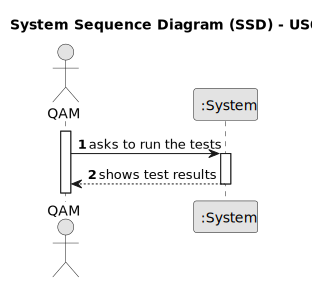

# US014 - Run tests for inputs of variable size, to observe the asymptotic behavior of the execution time of the US13

## 1. Requirements Engineering

### 1.1. User Story Description

As a Software Quality Assessment Team Manager, I want to run tests for inputs of variable size, to
observe the asymptotic behavior of the execution time of the US013
algorithm

### 1.2. Customer Specifications and Clarifications 

**From the specifications document:**

>	

>	 

**From the client clarifications:**

> **Question:** 
>
> **Answer:** 

> **Question:** 
>
> **Answer:** 

### 1.3. Acceptance Criteria

* **AC1:** The graphic referring to the asymptotic behavior of the execution running time tests should be presented in a time unit that allows to distinguish the running times of all tested examples.
* **AC2:** The procedure should run for 30 given files, and return (i) a .csv file with (input size, execution time) of the algorithm, and (ii) an image file with the execution time graphic, as a function of the input size, for the .csv data (use any package, for example, Gnuplot). 
* **AC3:** Work delivery format: a folder with (i) the .csv file for the 30 examples available, and (ii) an image file with the graphic of the execution time as a function of the input size, for this .csv data.

### 1.4. Found out Dependencies

* There is a dependency on US013 as there must be at least one algorithm applied to run the tests.

### 1.5 Input and Output Data

**Input Data:**

* Typed data:
    * none
	
* Selected data:
    * none

**Output Data:**

* Test results
* (In)Success of the operation

### 1.6. System Sequence Diagram (SSD)

**_Other alternatives might exist._**

### 1.7 Other Relevant Remarks

* none