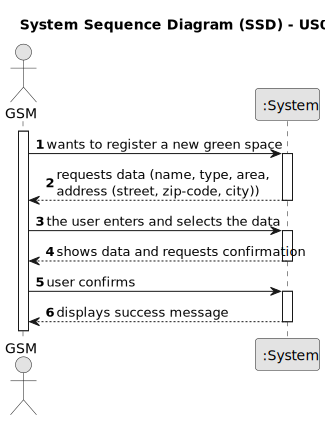

# US020 - Register a green space and its respective area

## 1. Requirements Engineering

### 1.1. User Story Description

As a Green Space Manager (GSM), I want to register a green space (garden, medium-sized park or large-sized park) and its respective area.

### 1.2. Customer Specifications and Clarifications 

**From the specifications document:**

> A green space needs to have a name, a type (garden, medium-sized park or large-sized park) and his respective area.

**From the client clarifications:**

> **Question:** The green space needs to have a name?
> 
> **Answer:** Yes. In that case, the name should be the «park» name, defined by the GSM registering it.

> **Question:** To register a green space, what is the criteria needed to classify it as a medium-sized park or a large-sized park?
> 
> **Answer:** It's a GSM responsability to decide the classification.

> **Question:** In which unit should the area be measured in?
>
> **Answer:** Usually, areas are measured in hectares.

> **Question:** Can the GSM register multiple green spaces at once?
> 
> **Answer:** That's a matter of UX/UI, each dev team can decide about it.

### 1.3. Acceptance Criteria

* **AC1:** All attributes must be filled with a valid form.

### 1.4. Found out Dependencies

* There needs to be a collaborator (US3) with the work of GSM (US2).

### 1.5 Input and Output Data

**Input Data:**

* Typed data:
    * Name
    * Area
    * Address (street, zip-code, city)
	
* Selected data:
    * Type (garden, medium-sized park or large-sized park)

**Output Data:**

* (In)Success of the operation

### 1.6. System Sequence Diagram (SSD)

**_Other alternatives might exist._**

#### Alternative One

### 1.7 Other Relevant Remarks

* none